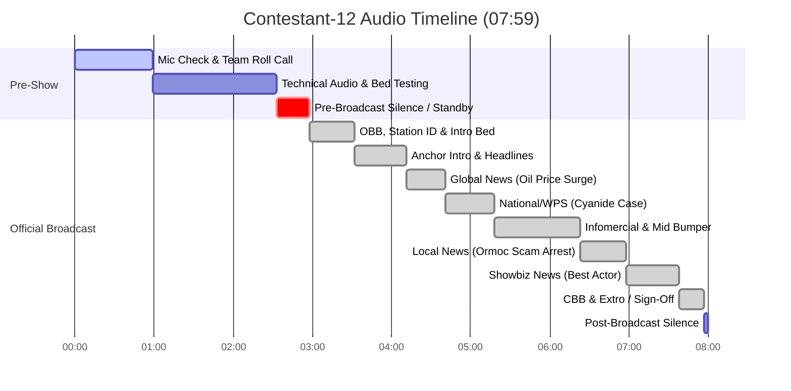

# Radio Broadcast Full Transcript — Contestant 12

## 📊 Broadcast & Recording Metadata

| Field | Value |
|---|---|
| **Audio File** | `NSPC-Samples/Contestant-12.mp3` |
| **Source Data** | `scratch_transcripts/Contestant-12.json` |
| **Contestant ID** | Contestant-12 |
| **Competition Event** | NSPC Radio Broadcasting & Scriptwriting (Filipino Medium) |
| **Total Audio Duration** | 07:59 (479.26 seconds) |
| **Language** | Filipino / Tagalog, English (Taglish) |
| **Station ID / Call Sign** | PCTV 9126 *(heard as DZJB 91.26 / PCTV 9126)* |
| **Program Title** | NSPC Patrol *(heard as NSP, si Patron / NSP, si Pagod)* |
| **Broadcast Date / Day** | Miyerkules, Ikalabing-lima *(spoken as "Ang Merkoles, kaliming lima")* |
| **Section Breakdown** | • **Section 1: Mic Check & Technical Setup:** `00:00 - 02:33` (153.50s) • **Section 2: Pre-Broadcast / Transition:** `02:33 - 02:58` (25.00s) • **Section 3: Actual Radio Broadcast:** `02:58 - 07:57` (298.02s) • **Section 4: Post-Broadcast Silence / Outro:** `07:57 - 08:00` (2.74s) |

---

## 👥 Production Team & Speakers

| Role / Label | Identified Name | Function & Signature Line / Spiel |
|---|---|---|
| **ANCHOR 1** | Dwayne Cancino *(Dwayne Cansino)* | Main Lead Anchor (Male) — *"Anong balita? Ako ang inyong ang panguno, Dwayne Cansino"* / *"Ang Merkoles, kaliming lima, nang mabigit ako, si Dwayne Cancino"* |
| **ANCHOR 2** | Grace Villamon | Co-Anchor (Female) — *"Ako naman ang inyong angkotos, Grace Villamon"* / *"At ako naman si Grace Villamon"* |
| **NEWSCASTER 1** | Marco Lalingon *(Michael Aliud)* | World & National News Presenter — *"Pag sa balitang maaakasahan, ang inyong likod, Marco Lalingon"* (Oil price surge report) |
| **NEWSCASTER 2** | Abby Pangutin | National & Maritime News Presenter — *"At ako naman si Abby Pangutin, na naaarangkada sa Balitaal"* (Cyanide fishing in WPS report) |
| **LOCAL NEWS REPORTER** | Layen Anggaboy *(Lahay ng Gamoy / Davina Angaboy)* | Local News Presenter (Ormoc City) — *"At ako pa rin ang inyong kaagapay sa balitang lokal, Lahay ng Gamoy"* / *"Para sa NSP, si Patron, ako si Lahay Nanggaboy"* |
| **SHOWBIZ REPORTER** | Nicole Pigao *(Nicole Viga / Nico Pita)* | Entertainment Reporter / Chikadora — *"Ang inyong chikatora, Nicole Viga"* / *"Ako ang Yung Chika-Dora, Nico Pigao ng NSP, si Patron"* |
| **TECHNICAL DIRECTOR** | Jeanette Cabrera | Technical Board Operator & Audio Controller — *"Ito naman si Jeanette Cabrera para sa Pagsubo sa Teknikal"* |
| **INFOMERCIAL ENSEMBLE** | Production Cast | Developmental PSA Voices — *"May mali para kami to... Hindi namin namin mamuhay ng malayang payapa... Pag buhay di, kaya ninyo rin kami"* |
| **STATION VOICE / ENSEMBLE** | Full Team | Station ID & Sign-off Ensemble — *"NSPC Patrol"*, *"PCTV 9126"*, *"Maraming salamat at may umataw, Pilipinas"* |

---

## ⏱️ Timeline & Section Breakdown

| Section | Timestamp Range | Duration | Description |
|---|---|---|---|
| **Section 1: Mic Check & Technical Setup** | `00:00 - 02:33` | 02:33 (153.50s) | Voice checks, team member roll call, signature line rehearsals, and technical audio board bed tests |
| **Section 2: Pre-Broadcast / Transition** | `02:33 - 02:58` | 00:25 (25.00s) | Studio silence, technical standby, preparation for official live broadcast cue |
| **Section 3: Actual Radio Broadcast** | `02:58 - 07:57` | 04:59 (298.02s) | Official competitive broadcast performance from Opening Billboard (OBB) to Closing Billboard (CBB) |
| **Section 4: Post-Broadcast Silence / Outro** | `07:57 - 08:00` | 00:03 (2.74s) | Studio room tone and end of recording file |

---

## 📜 Full Verbatim Transcript

### SECTION 1: MIC CHECK & TECHNICAL SETUP [00:00 - 02:33]

`[00:00 - 00:03]`  
**ANCHOR 1 / TEAM:** Hello, Luzon, Visayas, at Mindanao!

`[00:04 - 00:06]`  
**ANCHOR 2 / TEAM:** Maayong Adlaw or Makanas!

`[00:07 - 00:11]`  
**ANCHOR 1 / TEAM:** Magandang araw, Luzon, Visayas, at Mindanao!

`[00:13 - 00:19]`  
**ANCHOR 2 / TEAM:** Luzon, Maayong Adlaw, Luzon, Visayas, at Mindanao!

`[00:21 - 00:23]`  
**TEAM ENSEMBLE:** Luzon, Visayas, at Mindanao!

`[00:24 - 00:27]`  
**TEAM ENSEMBLE:** Mga maralang kami nagbabalik para makatit ng mga patoto.

`[00:27 - 00:31]`  
**ANCHOR 1 (Dwayne Cancino):** Anong balita? Ako ang inyong ang panguno, Dwayne Cansino.

`[00:31 - 00:35]`  
**ANCHOR 2 (Grace Villamon):** Ako naman ang inyong angkotos, Grace Villamon.

`[00:35 - 00:39]`  
**NEWSCASTER 1 (Marco Lalingon):** Pag sa balitang maaakasahan, ang inyong likod, Marco Lalingon.

`[00:41 - 00:45]`  
**NEWSCASTER 2 (Abby Pangutin):** At ako naman si Abby Pangutin, na naaarangkada sa Balitaal.

`[00:45 - 00:48]`  
**SHOWBIZ REPORTER (Nicole Pigao / Viga):** Ang inyong chikatora, Nicole Viga.

`[00:49 - 00:54]`  
**LOCAL NEWS REPORTER (Layen Anggaboy):** At ako pa rin ang inyong kaagapay sa balitang lokal, Lahay ng Gamoy.

`[00:55 - 00:58]`  
**TECHNICAL DIRECTOR (Jeanette Cabrera):** Ito naman si Jeanette Cabrera para sa Pagsubo sa Teknikal.

`[00:59 - 01:25]`  
*[AUDIO: Technical audio board testing, music beds, background effects check, and sound level adjustments]*

`[01:26 - 01:38]`  
**TECHNICAL DIRECTOR (Jeanette Cabrera):** Ito naman si Jeanette Cabrera para sa Pagsubo sa Teknikal.  
*[AUDIO: Background music bed test continues]*

`[01:38 - 02:04]`  
*[AUDIO: Technical audio testing, stinger level adjustments, and studio ambience]*

`[02:05 - 02:33]`  
**TECHNICAL DIRECTOR (Jeanette Cabrera):** Ito naman si Jeanette Cabrera para sa Pagsubo sa Teknikal.  
*[AUDIO: Final audio board level calibration and stinger test]*

---

### SECTION 2: PRE-BROADCAST / TRANSITION [02:33 - 02:58]

`[02:33 - 02:58]`  
*[AUDIO: Studio silence, room tone, talent positioning, standby for official broadcast cue]*

---

### SECTION 3: ACTUAL RADIO BROADCAST [02:58 - 07:57]

#### 1. Opening Billboard (OBB) & Station ID [02:58 - 03:32]

`[02:58 - 03:05]`  
`[AUDIO: FAST-PACED UPBEAT OPENING THEME BED SWELLS UP]`  
`[SFX: STATION STINGER / DRUM ACCENT]`

`[03:05 - 03:32]`  
**STATION VOICE / ENSEMBLE:**  
NSPC Patrol! PCTV 9126!  
`[AUDIO: NEWS BED SWELLS THEN DUCKS UNDER SPEECH]`

---

#### 2. Date Spiel, Anchor Intro & Opening Headlines [03:32 - 04:11]

`[03:32 - 03:35]`  
**ANCHOR 1 (Dwayne Cancino):**  
Ang Merkoles, kaliming lima, nang mabigit ako, si Dwayne Cancino.

`[03:35 - 03:37]`  
**ANCHOR 2 (Grace Villamon):**  
At ako naman si Grace Villamon.

`[03:39 - 03:41]`  
**ANCHORS (Dwayne Cancino & Grace Villamon):**  
Para sa ulo ng managpapagang balita,

`[03:41 - 03:42]`  
`[SFX: HEADLINE STINGER ACCENT]`

`[03:42 - 03:47]`  
**ANCHOR 1 (Dwayne Cancino):**  
pagkaas na ang presyo ng lamis, umabot na sa mabigit isang dangkulya kada barilis.

`[03:47 - 03:47]`  
`[SFX: HEADLINE STINGER ACCENT]`

`[03:47 - 03:52]`  
**ANCHOR 2 (Grace Villamon):**  
Pinsalang dinulog ng China Air Forces at ang Pilipin at Pilipin Post Guard nagbigay aksyon.

`[03:52 - 03:52]`  
`[SFX: HEADLINE STINGER ACCENT]`

`[03:52 - 03:57]`  
**ANCHOR 1 (Dwayne Cancino):**  
Iska-murder, pinatitong sangkot sa iligat na magbenta ng financial accounts, aarestaro.

`[03:57 - 03:58]`  
`[SFX: HEADLINE STINGER ACCENT]`

`[03:58 - 04:02]`  
**ANCHOR 2 (Grace Villamon):**  
Michael P. Jordan ang timidisya may itinanghan ng best actor.

`[04:03 - 04:11]`  
`[AUDIO: HEADLINE BUMPER TRANSITION / NEWS BED SWELLS AND SETTLES UNDER]`

---

#### 3. World / Global News: Oil Price Surge [04:11 - 04:41]

`[04:11 - 04:16]`  
**ANCHOR 1 (Dwayne Cancino):**  
Sa rito ng patatensyon sa pagkita ng Iraq at Israel, patuloy pa rin ang pagkaas na presyo ng lamis.

`[04:16 - 04:19]`  
**ANCHOR 1 (Dwayne Cancino):**  
At para sa ulo na ito, nalang ito si Michael Aliud.

`[04:20 - 04:21]`  
`[AUDIO: NEWS REPORT BED IN]`

`[04:21 - 04:27]`  
**NEWSCASTER 1 (Marco Lalingon):**  
Bumalo na sumigit isang daan dulyar ang presyo ng lamis kada barilis na mayroon 5.7% na itala kada araw.

`[04:27 - 04:34]`  
**NEWSCASTER 1 (Marco Lalingon):**  
Dahil na ito, nanapin pre-critical ang strength of our most global iron road na may dalalaman na out-of-supply ng lamis.

`[04:34 - 04:40]`  
**NEWSCASTER 1 (Marco Lalingon):**  
Doon pa man, patuloy pa rin ang pagkaas na presyo ng lamis at wala pa rin na sabit ulan kung kailan ito bababa.

---

#### 4. National / Maritime News: WPS Cyanide Case [04:41 - 05:18]

`[04:41 - 04:48]`  
**ANCHOR 2 (Grace Villamon):**  
At itamang dudukan ang pag-akusa ng Pilipinas sa mga manging isdang chino doble sa paggabit ng cyanide.

`[04:48 - 04:48]`  
**ANCHOR 2 (Grace Villamon):**  
Abis?

`[04:48 - 04:49]`  
`[AUDIO: FIELD REPORT BED IN]`

`[04:49 - 04:56]`  
**NEWSCASTER 2 (Abby Pangutin):**  
Grace, inakusahan ng Pilipinas ang mga manging isdang chino kaunan sa pagbulos ng cyanide sa Tuhutsis Prakti Island.

`[04:56 - 05:05]`  
**NEWSCASTER 2 (Abby Pangutin):**  
Ayon sa National Security Council, maaaring makapromisa ang usaktura ng mga barko dahil sa piksarang tulog ng cyanide sa coral reef.

`[05:05 - 05:11]`  
**NEWSCASTER 2 (Abby Pangutin):**  
Sa ngayon, inatasan ng NLC ang Armed Forces of the Fronting Coast Guard na paitingin ang pagpamantay sa lugar.

`[05:11 - 05:14]`  
**NEWSCASTER 2 (Abby Pangutin):**  
Upang maliwasan ang karagdagang pinsala sa kalikasan.

`[05:14 - 05:18]`  
**NEWSCASTER 2 (Abby Pangutin):**  
Para sa NSP, si Pagod Baliseo kaya isang isalamang ahi.

---

#### 5. Developmental Infomercial / PSA Break & Mid Bumper [05:19 - 06:23]

`[05:19 - 05:24]`  
`[AUDIO: INFOMERCIAL JINGLE / SOUND EFFECTS IN]`  
**INFOMERCIAL TALENT 1:**  
May mali para kami to.

`[05:24 - 05:27]`  
**INFOMERCIAL TALENT 2:**  
Hindi namin namin mamuhay ng malayang payapa.

`[05:27 - 05:31]`  
**INFOMERCIAL ENSEMBLE:**  
Pag buhay di, kaya ninyo rin kami.

`[05:32 - 06:23]`  
`[AUDIO: INFOMERCIAL EXTRO / MUSIC BED TRANSITION TO STATION BUMPER]`  
**ANCHOR 1 / ANCHOR 2 / TEASER:**  
Malami ng pagka-aresto ng isang binatinyo sa leite sa pagbibindang financial account.

---

#### 6. Local News: Ormoc City Account Scamming Arrest [06:23 - 06:58]

`[06:23 - 06:24]`  
**ANCHOR 2 (Grace Villamon):**  
Aba, scam pala.

`[06:24 - 06:26]`  
**ANCHOR 1 (Dwayne Cancino):**  
Lain mula sa form of city.

`[06:26 - 06:28]`  
**ANCHOR 1 (Dwayne Cancino):**  
Narito si Davina Angaboy.

`[06:28 - 06:34]`  
`[AUDIO: LOCAL NEWS BED IN]`  
**LOCAL NEWS REPORTER (Layen Anggaboy):**  
Inaresto ang isang dilatinyo matapos ang iligal na pagbenda ng account papilasyal at pinangalanan pa.

`[06:34 - 06:36]`  
**LOCAL NEWS REPORTER (Layen Anggaboy):**  
Bilang alias kamboy sa Ormoc City, Leyte.

`[06:36 - 06:43]`  
**LOCAL NEWS REPORTER (Layen Anggaboy):**  
Nilabag nito ang Section 5 of Republic Act 12010 o ang Anti-Financial Account Scamming.

`[06:43 - 06:51]`  
**LOCAL NEWS REPORTER (Layen Anggaboy):**  
Gayunpuman, nasa kusudiyanan ng polisya ang sospek at inaanyahanan na ng otoridad ang publiko na maging wais sa online transactions.

`[06:52 - 06:55]`  
**LOCAL NEWS REPORTER (Layen Anggaboy):**  
Para sa NSP, si Patron, ako si Lahay Nanggaboy.

`[06:55 - 06:56]`  
**LOCAL NEWS REPORTER (Layen Anggaboy):**  
Balik sa iyo, Dwayne.

`[06:56 - 06:58]`  
**ANCHOR 1 (Dwayne Cancino):**  
Maraming salamat, Lainang.

---

#### 7. Showbiz News: Best Actor Awards & Controversies [06:58 - 07:38]

`[06:58 - 07:03]`  
**ANCHOR 1 (Dwayne Cancino):**  
Para sa balitang showbiz, alamin naman natin ang pagkapanalo ng...

`[07:04 - 07:05]`  
**SHOWBIZ REPORTER (Nicole Pigao):**  
Nico Pita.

`[07:06 - 07:07]`  
**SHOWBIZ REPORTER (Nicole Pigao):**  
Kao'y Chika-Dora.

`[07:07 - 07:09]`  
**ANCHOR 2 (Grace Villamon):**  
Grace Bumbina.

`[07:09 - 07:15]`  
`[AUDIO: SHOWBIZ BED IN]`  
**SHOWBIZ REPORTER (Nicole Pigao):**  
Si Michael Jordan kasama si Timuki Xiaomei na nakakuha ng number of awards.

`[07:15 - 07:25]`  
**SHOWBIZ REPORTER (Nicole Pigao):**  
Nabahangan naman si Xiaomei ng karanihan ng pagwawagin ni Xiaomei.

`[07:25 - 07:32]`  
**SHOWBIZ REPORTER (Nicole Pigao):**  
Maraming mambuboto ang nambabatikos sa kanyang gossip at unconventional.

`[07:33 - 07:37]`  
**SHOWBIZ REPORTER (Nicole Pigao):**  
Ako ang Yung Chika-Dora, Nico Pigao ng NSP, si Patron.

---

#### 8. Closing Billboard (CBB), Extro & Sign-Off [07:39 - 07:57]

`[07:39 - 07:41]`  
`[AUDIO: CLOSING THEME BED SWELLS UP]`  
**ANCHOR 1 (Dwayne Cancino):**  
At yan ang katapos ang mga balitang.

`[07:41 - 07:43]`  
**ANCHOR 2 (Grace Villamon):**  
Aliso sa panguling.

`[07:43 - 07:45]`  
**ANCHOR 1 (Dwayne Cancino):**  
Ako si Dwayne Cancino.

`[07:45 - 07:46]`  
**ANCHOR 2 (Grace Villamon):**  
At ako naman...

`[07:46 - 07:47]`  
**ANCHOR 2 (Grace Villamon):**  
On Secrets, P1.

`[07:47 - 07:50]`  
**ANCHORS / ENSEMBLE:**  
Ito ang NSP, si Patron.

`[07:51 - 07:53]`  
**STATION VOICE / ENSEMBLE:**  
PCTV 9126.

`[07:53 - 07:56]`  
**FULL ENSEMBLE:**  
Maraming salamat at may umataw, Pilipinas.

`[07:56 - 07:57]`  
`[AUDIO: CLOSING THEME SWELLS TO CLIMAX AND FADES OUT]`

---

### SECTION 4: POST-BROADCAST SILENCE / OUTRO [07:57 - 08:00]

`[07:57 - 08:00]`  
*[AUDIO: Room ambience and end of audio recording]*
