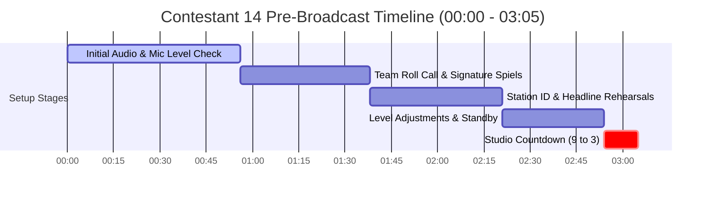

# Contestant 14 — Mic Check & Pre-Broadcast Analysis

## 📊 Mic Check Metadata

| Field | Value |
|---|---|
| **Audio File** | `NSPC-Samples/Contestant-14.mp3` |
| **Source Data** | `scratch_transcripts/Contestant-14.json` & Audio Verification |
| **Contestant ID** | Contestant 14 |
| **Mic Check Timestamp Range** | `00:00 - 02:40` (0.00s - 160.00s) |
| **Pre-Broadcast Standby / Countdown Range** | `02:40 - 03:05` (160.00s - 185.00s) |
| **Total Pre-Broadcast Duration** | 03:05 (185.00 seconds) |
| **Language** | Filipino / Tagalog, Taglish |
| **Competition Event** | NSPC Radio Broadcasting & Scriptwriting (Filipino Medium) |
| **Station ID / Program** | DZJV 91.26 / NSPC Patrol |

---

## 👥 Personnel & Production Cast

| Speaker / Role | Identified Name | Sound Check & Pre-Broadcast Function |
|---|---|---|
| **ANCHOR 1 (Lead Anchor)** | MJ Calano *(also referred to as "FJ")* | Studio mic check, team lead intro practice (*"Ako po ang inyong anchor 1 at newscaster 1, MJ Calano po!"*), headline practice |
| **ANCHOR 2 (Co-Anchor)** | Linel Antupo *(heard as "Linel Antupo" / "Lienel Antopina")* | Co-anchor mic check, role call (*"Linel Antupo, ang inyong ikalawang tagapagbalita!"*), headline practice |
| **NEWSCASTER 1 / INFOMERCIAL** | Kaila *(Ormoc City Cyber Response Team)* | Field / studio mic test, role call (*"Kaila, ang inyong infomercialist, at inyong ikalawang tagapagbalita!"*) |
| **SPORTSCASTER** | AJ Pablo | Sports mic channel check (*"At sa balitang sports, AJ Pablo!"*) |
| **SHOWBIZ REPORTER** | Sophia | Showbiz mic check, role call (*"At hindi nagpapahuli... Sophia... Para sa showbiz balita!"*) |
| **TECHNICAL DIRECTOR** | Audio Board Operator | Audio bed fader testing, SFX level balancing, track arming, countdown cues (*"Broadcast starts in 9, 8, 7, 6, 5, 4, 3..."*) |

---

## ⏱️ Pre-Broadcast Timeline Breakdown

| Phase | Timestamp Range | Duration | Technical Description |
|---|---|---|---|
| **Phase 1: Console Setup & Initial Mic Check** | `00:00 - 00:56` | 00:56 (56.00s) | Audio console initialization, playback bed testing, volume leveling, background room tone check |
| **Phase 2: Team Member Roll Call & Spiels** | `00:56 - 01:38` | 00:42 (42.00s) | Presenters self-introduction practice, microphone level balancing, team unison chant rehearsal |
| **Phase 3: Station ID & Headline Rehearsal** | `01:38 - 02:21` | 00:43 (43.00s) | Station ID rehearsal (*"DZJV 91.26 NSPC Patrol"*), top headline readings and greetings practice |
| **Phase 4: Level Adjustments & Standby** | `02:21 - 02:54` | 00:33 (33.00s) | Final sound system calibration, talent positioning, console fader checks |
| **Phase 5: Studio Countdown to Air** | `02:54 - 03:05` | 00:11 (11.00s) | Technical director countdown (*"Broadcast starts in 9, 8, 7, 6, 5, 4, 3..."*) into Opening Billboard |

---

## 🎙️ Verbatim Mic Check & Setup Transcript

### 1. Initial Microphone & Audio Bed Level Calibration [00:00 - 00:56]

`[00:00 - 00:15]`  
**TALENT / TEAM:** Hello, sound check 1, 2, 3... Hello, sound... Hello.

`[00:15 - 00:35]`  
*[AUDIO: MUSIC BED LEVEL TESTING, SFX PLAYBACK CHECK & AMBIENT STUDIO SOUNDS]*  
**TALENT:** Hello, hello, hello...

`[00:35 - 00:56]`  
*[AUDIO: TALENT MICROPHONE LEVEL BALANCING & AUDIO BED VOLUME ADJUSTMENT]*  
**FULL ENSEMBLE:** NSPC Patrol!

---

### 2. Team Roll Call & Signature Spiels Practice [00:56 - 01:38]

`[00:56 - 01:03]`  
**ANCHOR 1 (MJ Calano):**  
Ayan! Hello, hello, hello po sa ating mga listeners diyan! Ako po ang inyong anchor 1 at newscaster 1, MJ Calano po!

`[01:03 - 01:10]`  
**ANCHOR 2 (Linel Antupo):**  
Ito naman ang inyong kasama... Linel Antupo, ang inyong ikalawang tagapagbalita!

`[01:10 - 01:17]`  
**SPORTSCASTER (AJ Pablo):**  
At sa balitang sports, AJ Pablo kasama ninyo!

`[01:17 - 01:25]`  
**SHOWBIZ REPORTER (Sophia):**  
At hindi naman magpapahuli... Sophia... para sa showbiz balita!

`[01:25 - 01:33]`  
**NEWSCASTER 1 / INFOMERCIAL (Kaila):**  
Kaila... ang inyong infomercialist, at inyong ikalawang tagapagbalita!

`[01:34 - 01:38]`  
**FULL ENSEMBLE:**  
Pilipinas! BAYAN! BALITAAN NA!

---

### 3. Station ID & Headline Rehearsals [01:38 - 02:21]

`[01:38 - 01:50]`  
**STATION VOICE / ANCHOR 1:**  
Ito ang DZJV 91.26 NSPC Patrol.

`[01:51 - 01:59]`  
**ANCHOR 1 (MJ Calano):**  
Lagot! Iligal ang pagbebenta ng ATM cards at financial accounts, maaaring kasuhan ng Anti-Financial Account Scamming Act.

`[01:59 - 02:04]`  
**ANCHOR 2 (Linel Antupo):**  
Presyo ng petrolyo sa US nananatiling mataas dahil sa giyera sa Middle East.

`[02:04 - 02:11]`  
**ANCHORS / ENSEMBLE:**  
Isyung napapanahon! Rundown ng mga balita! Sa NSPC Patrol, aming ihahatid!

`[02:11 - 02:21]`  
**ANCHOR 1 (MJ Calano):**  
Magandang araw Luzon, Visayas, at Mindanao! Magandang araw partner!  
**ANCHOR 2 (Linel Antupo):**  
Magandang araw din partner at maayong adlaw sa ating mga listeners diyan.

---

### 4. Level Adjustments & Pre-Broadcast Standby [02:21 - 02:54]

`[02:21 - 02:40]`  
**TALENT / TEAM:** Testing, testing... Hello, sound check.

`[02:40 - 02:54]`  
**TALENT / TEAM:** Kaya natin 'to. Kaya natin 'to ngayon.  
*[STUDIO SILENCE: TECHNICAL DIRECTOR ARMS AUDIO TRACKS & CUES TAPE]*

---

### 5. Final Countdown to Air [02:54 - 03:05]

`[02:54 - 03:05]`  
**TECHNICAL DIRECTOR:**  
Broadcast starts in 9, 8, 7, 6, 5, 4, 3...  
*[STUDIO SILENCE: 2, 1 CUE — FADER UP FOR OPENING BILLBOARD]*
