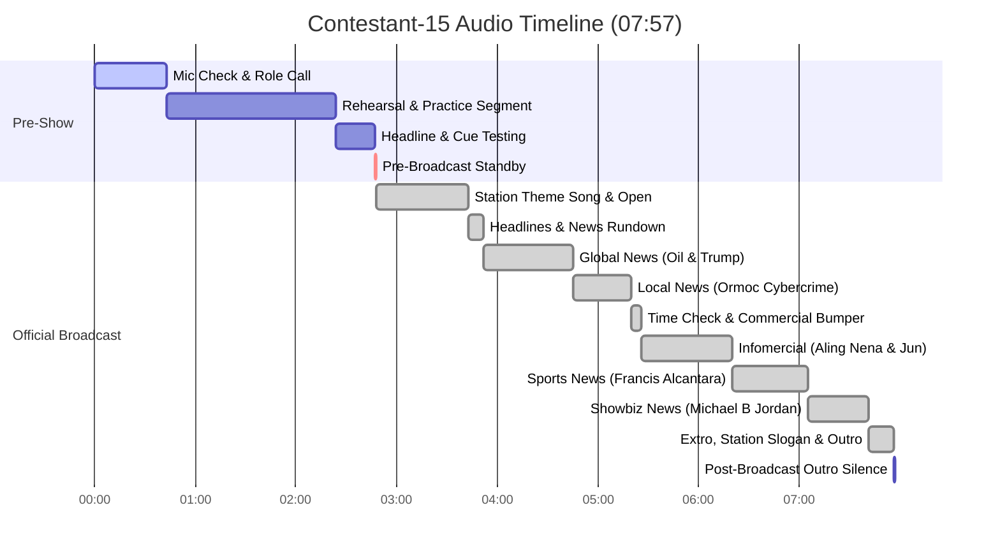

# Radio Broadcast Full Transcript — Contestant 15

## 📊 Broadcast & Recording Metadata

| Field | Value |
|---|---|
| **Audio File** | `NSPC-Samples/Contestant-15.mp3` |
| **Source Data** | `scratch_transcripts/Contestant-15.json` |
| **Contestant ID** | Contestant-15 |
| **Competition Event** | NSPC Radio Broadcasting & Scriptwriting (Filipino Medium) |
| **Total Audio Duration** | 07:57 (477.36 seconds) |
| **Language** | Filipino / Tagalog, Taglish |
| **Station ID / Call Sign** | DZJB 91.26 *(NSPC Patrol)* |
| **Program Title** | NSPC Patrol *(DZJB 91.26)* |
| **Broadcast Time Check** | 3:59 PM *(Alas-tres singkuwenta'y nuwebe ng hapon)* |
| **Section Breakdown** | • **Section 1: Mic Check & Technical Setup:** `00:00 - 02:47` (167.14s) • **Section 2: Pre-Broadcast / Transition:** `02:47 - 02:48` (0.64s) • **Section 3: Actual Radio Broadcast:** `02:48 - 07:56` (308.07s) • **Section 4: Post-Broadcast Silence / Outro:** `07:56 - 07:57` (1.51s) |

---

## 👥 Production Team & Speakers

| Role / Label | Identified Name | Function & Signature Line / Spiel |
|---|---|---|
| **ANCHOR 1** | JB Rustia ("JB") | Main Lead Anchor (Male) — *"Ako pa rin po ang inyong poging news anchor, ako po si JB Rustia"* / *"Mga kapatid sa Luzon, tara na! Sa mga taga-Visayas, padayon ta! At sa mga taga-Mindanao, larga na! Ako si JB Rustia."* |
| **ANCHOR 2** | Franz Ambas ("Franz") | Co-Anchor (Male) — *"Aba, aba, ang bagsik! Ako naman ang inyong Anchor 2, Franz Ambas"* / *"At sa lahat ng sulok naabot ng ating pagsasahimpapawid, ako si Franz Ambas."* |
| **NEWSCASTER 1** | Flenkie Paul / Plinky Paul | World & National News Presenter — *"'Tol newscaster, Flenkie Paul"* / *"Flenkie Paul, bumabalita para sa bayan!"* (Middle East Oil Crisis & Donald Trump Report) |
| **NEWSCASTER 2** | Janine Aventurado | Local / Cybercrime News Presenter — *"Princess ng Team Pogi, Janine Aventurado"* / *"Janine Aventurado, bumabalita para sa masa!"* (Ormoc City Cybercrime / RA 12010 Arrest Report) |
| **INFOMERCIAL VOICE 1** | Junjun (Team Member) | Young Consumer / Customer — *"Isang araw, pumunta ako sa tindahan ni Aling Nena para bumili ng lobo... Unahin ang pagkain, kuryente, at tubig..."* |
| **INFOMERCIAL VOICE 2** | Aling Nena (Team Member) | Store Owner / Elder — *"Naku, Junjun! Nakailang lobo na sa palabunutan ko... Maging wais ka sa panggastos mo ngayong may National Energy Emergency..."* |
| **INFOMERCIAL NARRATOR** | Production Cast | Voiceover / Advocacy Slogan — *"Tindahan ni Nena. Tandaan, para bawat hugot ay iwas-punit sa bulsa!"* |
| **SPORTSCASTER** | Roy Alegre | Sports News Presenter — *"Para naman sa balitang de-kalibre, Roy Alegre"* / *"Roy Alegre, bumabangon para sa balitang sports!"* (Francis Casey Alcantara & Fujairah Open Report) |
| **SHOWBIZ REPORTER** | Mamshie Kirby ("Queen with a K, Kirby") | Entertainment Reporter — *"Koronahan niyo na, 'mi! This is still your Queen with a K, Kirby"* / *"Bangon, may chika! Queen with a K, Kirby para sa NSPC!"* (Michael B. Jordan Oscar Win) |
| **TECHNICAL DIRECTOR** | Team Member (Tyler / Kyle) | Audio Control Operator & Sound Effects Operator — *"Sa gabay ng aming Technical Director..."* |
| **STATION VOICE / ENSEMBLE** | Full Team | Station Jingle & Tagline Chorus — *"Sa bawat pagsikat ng araw... Pilipinas!"* / *"Ang kikisig! Husto! Aksyon! Ito ang DZJB 91.26, NSPC Patrol!"* |

---

## ⏱️ Timeline & Section Breakdown

| Section | Timestamp Range | Duration | Description |
|---|---|---|---|
| **Section 1: Mic Check & Technical Setup** | `00:00 - 02:47` | 02:47 (167.14s) | Microphone checks, team roll call with catchphrases, practice simulation of mini-program ("Rate Mo, Pitig Ko"), headline rehearsal, news bed run-through, cheer and applause |
| **Section 2: Pre-Broadcast / Transition** | `02:47 - 02:48` | 00:01 (0.64s) | Studio silence, technical standby, lead-in to opening jingle |
| **Section 3: Actual Radio Broadcast** | `02:48 - 07:56` | 05:08 (308.07s) | Complete official radio broadcast: opening station theme song, anchor spiels, headlines, world/national news, local cybercrime news, time check, infomercial, sports news, showbiz chika, and station sign-off |
| **Section 4: Post-Broadcast Outro** | `07:56 - 07:57` | 00:01 (1.51s) | Audio bed fade-out and final studio silence |

---

## 📝 Verbatim Full Transcript

### Section 1: Mic Check & Technical Rehearsal [00:00 - 02:47]

[00:01] **ANCHOR 1 (JB Rustia):** Ako pa rin po ang inyong poging news anchor.

[00:05] **ANCHOR 1 (JB Rustia):** Ako po si J.B. Ruskin. *(JB Rustia)*

[00:08] **ANCHOR 2 (Franz Ambas):** Ababa ang basa. *(Aba, aba, ang bagsik)* Ako na ang inyong anchor to France. *(Anchor 2, Franz)*

[00:12] **ANCHOR 2 (Franz Ambas):** Ang bas. *(Ambas)*

[00:13] **NEWSCASTER 1 (Flenkie Paul):** Opo po mga tropa. Ano dito na?

[00:15] **NEWSCASTER 1 (Flenkie Paul):** Ang tol ng skaters, *(Ang 'tol newscaster)* Flanky Paul. *(Flenkie Paul)*

[00:19] **NEWSCASTER 2 (Janine Aventurado):** At ako naman ang princess ng team Pony, *(Team Pogi)* Janine Alventurado. *(Janine Aventurado)*

[00:23] **SPORTSCASTER (Roy Alegre):** Para naman sa balitang dekalibre, *(de-kalibre)* Royal Legre. *(Roy Alegre)*

[00:27] **SHOWBIZ REPORTER (Mamshie Kirby):** Koronahan nyo na mi. *(Koronahan niyo na, 'mi)* This is still your queen with a K, Kirby.

[00:33] **TECHNICAL DIRECTOR / TEAM:** Sa amalan ng aming technical record, tayo pa rupan. *(Sa gabay ng aming Technical Director...)*

[00:37] **TEAM ENSEMBLE:** Walang inuha. *(Walang iwanan)*

[00:39] **TEAM ENSEMBLE:** Ito ang NSPC...

[00:42] **TEAM ENSEMBLE:** Patrol.

[00:43] **INFOMERCIAL CAST / PRESENTERS:** Ang Yelvin, Mariel, at Kelvin. *(Sina Yelvin, Mariel, at Kelvin)*

[00:52] **ANCHOR 1 / ANCHOR 2:** Susunod na ang NSPC Patrol na...

[00:54] **ANCHOR 1 / ANCHOR 2:** Team Pogi, Franz, at J.B.

[00:57] **ANCHOR 1 / ANCHOR 2:** Pero bago makasusunod na bahay taan, *(bago makatunghay sa balitaan)* pitikan muna tayo siya. *(silipin muna natin ito)*

[01:01] **ANCHOR 1 / ANCHOR 2:** Dahil ito na ang...

[01:02] **INFOMERCIAL CAST:** Race. *(Rate)*

[01:03] **INFOMERCIAL CAST:** Pinig ko. *(Pitig Ko)*

[01:03] **INFOMERCIAL CAST:** Pitig ko.

[01:04] **INFOMERCIAL VOICE 1:** Mula po sa ating rating question kahapon:

[01:07] **INFOMERCIAL VOICE 1:** Ano ang bucket list summer vacation locations mo?

[01:10] **INFOMERCIAL VOICE 1:** Heto na ang top 2 raters natin, sis.

[01:13] **INFOMERCIAL VOICE 2:** From at, not just me. *(@notjustme)*

[01:15] **INFOMERCIAL VOICE 2:** Panganap kong mag-Korea para nabigid. *(Pangarap kong mag-Korea para maiba)*

[01:17] **INFOMERCIAL VOICE 2:** Pero parang bagyo na ng pala kasi... *(parang Baguio na lang pala kasi...)*

[01:19] **INFOMERCIAL VOICE 2:** I love the Philippines.

[01:20] **INFOMERCIAL VOICE 1:** Wow. Kung ang may pagusto *(iba ay gusto)* ng summer heat, ikaw ay gusto ng cold day heat. *(cold day breeze)*

[01:24] **INFOMERCIAL VOICE 1:** Oo. Kaya lang, marami mong pipisita *(marami kang bibisita)* dyan ha.

[01:27] **INFOMERCIAL VOICE 1:** Dahil Baguio ang ating summer capital.

[01:29] **INFOMERCIAL VOICE 1:** Dahil dyan, meron ka limang pitig with...

[01:32] **INFOMERCIAL VOICE 2:** Soft Moves.

[01:34] **INFOMERCIAL VOICE 2:** And naku, ako pa. Ako ha. Excited ako para dito kasusunod. *(sa susunod)*

[01:38] **INFOMERCIAL VOICE 2:** Oiko, *(Eto)* mula kay Asmar Lucie. *(@smarlucie)*

[01:40] **INFOMERCIAL VOICE 2:** I still can't believe my long-time dream of pitching LSPC. *(reaching NSPC)*

[01:44] **INFOMERCIAL VOICE 2:** Grabe, meron pang Ormoc City.

[01:47] **INFOMERCIAL VOICES:** Hashtag, rate mo...

[01:48] **INFOMERCIAL VOICES:** Pinig ko. *(Pitig Ko)*

[01:49] **INFOMERCIAL VOICE 1:** Wow. Ganyan ang perfect na galaw. Diba? May purpose, tapos masaya.

[01:54] **INFOMERCIAL VOICE 2:** Good luck.

[01:55] **INFOMERCIAL VOICE 1:** Cheers.

[01:57] **INFOMERCIAL VOICE 1:** Dahil dyan, meron kang unlimited with extra soft moves.

[02:02] **INFOMERCIAL VOICE 2:** Ipadala niyo naman po kay niyong *(ang inyong)* sagot sa tanong na anong viral food ngayon

[02:06] **INFOMERCIAL VOICE 2:** ang tunay na worth the high *(worth the hype)* para sa susunod na episode na Rate Mo, Pinig Ko. *(Rate Mo, Pitig Ko)*

[02:13] **ANCHOR 1 / ANCHOR 2:** Susunod naman Team Pogi, France, at JB. Wala pa rin kong hilipat *(Huwag na po kayong lumipat ng)* ang estasyon dahil basta bali na ang ESPC na yan. *(bastang balita, NSPC Patrol na 'yan)*

[02:24] **ANCHOR 1 / ANCHOR 2:** Pag-inipit sa Strato for Moves, nakagpatakas *(Pag-ipit sa Strait of Hormuz, nagpataas)* sa foreign oil prices.

[02:29] **ANCHOR 1 / ANCHOR 2:** At lalang is *(lalaki sa)* Ormoc City, arestado dahil sa financial accounts kami. *(financial accounts scamming)*

[02:33] **ANCHOR 1 / ANCHOR 2:** Sa kaliwat ka *(kaliwa't kanang)* ng pagtaas ng presyo ng produktong petrolyo,

[02:37] **ANCHOR 1 / ANCHOR 2:** nanganganib ang global stock markets dulot ng tensyone sa ginagawa ng palagangan. *(tensyon sa gitnang silangan)*

[02:42] **TECHNICAL DIRECTOR / ALL:** Let's give a round of applause for Pag-inipatrol. *(NSPC Patrol)*

[02:47] `[APPLAUSE / CHEERING]`

---

### Section 2: Pre-Broadcast / Transition [02:47 - 02:48]

[02:47] `[BRIEF STUDIO SILENCE / TECHNICAL CUEING & BED IN]`

---

### Section 3: Actual Radio Broadcast [02:48 - 07:56]

[02:47] `[STATION THEME SONG / VOCAL JINGLE BED STARTS]`

[02:47] **STATION ID / CHORUS:**
Sa bawat pagsinikat *(pagsikat)* ng araw...

[03:04] **STATION ID / CHORUS:**
...kagandahan ang Visayas-Rindanao *(Visayas, Mindanao)* bago maangsigan...

[03:20] **STATION ID / CHORUS:**
Pilipinas.

[03:21] `[NEWS THEME BED UP AND UNDER]`

[03:23] **ANCHOR 2 (Franz Ambas):**
At sa lahat ng sulog, *(sulok)* naabot ng atas. *(ng ating)* Ating pagsasahing papawid, *(pagsasahimpapawid)* ako si Fran Zambas. *(Franz Ambas)*

[03:29] **ANCHOR 1 (JB Rustia):**
Mga kapatid sa Luzon, tara na! Sa mga taga-Visayas at Donata. *(padayon ta!)*

[03:32] **ANCHOR 1 (JB Rustia):**
At sa mga taga-Rindanao, *(Mindanao)* larga na! Ako si JB Rustia.

[03:37] **STATION ID CHORUS:**
Ito ang DZJB 9126, *(DZJB 91.26)*

[03:40] **STATION ID CHORUS:**
NSPC Patroler. *(NSPC Patrol)*

[03:42] `[HEADLINES BED / SFX: BEEP]`

[03:43] **ANCHOR 1 (JB Rustia):**
Pag-inipit sa Strato for Moves, nakagpatakas *(Pag-ipit sa Strait of Hormuz, nagpataas)* sa foreign oil prices.

[03:47] **ANCHOR 2 (Franz Ambas):**
At lalang is *(lalaki sa)* Ormoc City, arestado dahil sa financial accounts kami. *(financial accounts scamming)*

[03:52] `[STINGER / SPECIAL UPDATES BED]`

[03:52] **STINGER VOICE:**
Hinuwaan sa gitnang silangan, *(Hinugot sa Gitnang Silangan)*

[03:54] **STINGER VOICE:**
NSPC Patrol Special Updates.

[03:58] `[WORLD NEWS BED]`

[03:58] **ANCHOR 1 (JB Rustia):**
Sa kaliwat nga *(kaliwa't kanang)* ng pagtaas sa presyo ng produktong petroyo, *(petrolyo)*

[04:02] **ANCHOR 1 (JB Rustia):**
nangangalib *(nanganganib)* ang global stock markets dulot ng tensyon sa gitnang silangan.

[04:06] **ANCHOR 1 (JB Rustia):**
Ako na po, para sa mga detalye, hatip *(hatid)* ni Flinky Paul. *(Flenkie Paul)*

[04:09] **NEWSCASTER 1 (Flenkie Paul):**
JB, kumaray *(kumabog)* ang mundo sa patuloy na pagpagsak *(pagbagsak)* ng global stock markets at pagtaas ng presyo ng tadabarin *(pandaigdigang)* ng langis.

[04:17] **NEWSCASTER 1 (Flenkie Paul):**
Partikular na sa Amerika kung saan umabot na sa $111.

[04:21] **NEWSCASTER 1 (Flenkie Paul):**
Bukod sa langis, maapektuhan din ang inflation,

[04:23] **NEWSCASTER 1 (Flenkie Paul):**
Housing affordability at economic stability.

[04:26] **NEWSCASTER 1 (Flenkie Paul):**
Sa kabila ng tensyon, sinabing *(sinabi ni)* US President Donald Trump na maaayos ang diskusyon sa pagitan ng Iran at Amerika.

[04:33] **NEWSCASTER 1 (Flenkie Paul):**
Flinky Paul, *(Flenkie Paul)* bumabagol *(bumabalita)* para sa bagya. *(bayan)*

[04:37] `[STINGER / SPECIAL UPDATES BED]`

[04:37] **STINGER VOICE:**
Hinuwaan sa gitnang silangan, *(Hinugot sa Gitnang Silangan)*

[04:39] **STINGER VOICE:**
NSPC Patrol Special Updates.

[04:45] `[LOCAL NEWS BED]`

[04:45] **ANCHOR 2 (Franz Ambas):**
JB, mula Amerika, lipat naman tayo sa Ormoc City kung saan timbok *(timbog)* ang isang lalaki sa pagbebenta ng iligal na financial accounts. Paama. *(Kasama)*

[04:52] **ANCHOR 2 (Franz Ambas):**
Ang balitang iyan, hatip *(hatid)* ni Janine Aventurado.

[04:56] **NEWSCASTER 2 (Janine Aventurado):**
Sarehas, *(Rehas)* yan ang sinapit ng 29 atyos *(anyos)* sa Seria Sampoy *(suspect name)* matapos maburi *(mabuko)* sa entrapment operation ng Ormoc City Cyber Response Team.

[05:04] **NEWSCASTER 2 (Janine Aventurado):**
Nangangarap *(Nahaharap)* ang sospek sa kasong paglabag sa Repulking Act 12010 *(Republic Act 12010)* o ang Anti-Financial Fund Stunning Act. *(Anti-Financial Account Scamming Act)*

[05:10] **NEWSCASTER 2 (Janine Aventurado):**
Nagbaba na naman *(Nagbabala naman)* ang otoridad sa Agukiko *(publiko)* na mag-ingat sa ganitong klase ng pandudoko. *(panloloko)*

[05:15] **NEWSCASTER 2 (Janine Aventurado):**
Janine Aventurado, bumabagol *(bumabalita)* para sa masa.

[05:20] `[BUMPER / STINGER]`

[05:20] **BUMPER VOICE:**
Bogie! *(Pogi!)*

[05:21] **ANCHOR 1 (JB Rustia):**
Ang oras 3.59 ng hapon. *(3:59 ng hapon)*

[05:23] **ANCHOR 1 (JB Rustia):**
Magbabalik ang NSPC Patrola. *(NSPC Patrol)*

[05:26] `[COMMERCIAL / INFOMERCIAL BED]`

[05:26] **JUNJUN (Infomercial Voice 1):**
Isang araw, pumunta ako sa tindahan ni Aling Nena para bumili ng lobo.

[05:34] **ALING NENA (Infomercial Voice 2):**
Nakot, *(Naku)* Junjun! Nakailang lobo na sa palabunutan ko!

[05:37] **ALING NENA (Infomercial Voice 2):**
Ang lobo, dapat gaiho! *(galing sa ipon!)*

[05:43] **JUNJUN (Infomercial Voice 1):**
Bakit ko aking nakita? Mahapit ba ay sa tindahan na ka? *(Bakit po Aling Nena? Mahigpit po ba kayo sa tindahan ngayon?)*

[05:49] **ALING NENA (Infomercial Voice 2):**
Junjun, maging wahis *(wais)* ka sa tangas *(panggastos)* ko. *(mo)*

[05:51] **ALING NENA (Infomercial Voice 2):**
Kaming ang makapot ako *(Kailangang magtipid tayo)* ngayong may National Energy Emergency.

[05:54] **ALING NENA (Infomercial Voice 2):**
Ito na ang ipin sa pudo *(ipon sa bangko)* para may pangustos. *(panggastos)*

[05:56] **JUNJUN (Infomercial Voice 1):**
Sabi sa amin sa school, pangunahin pa ang kailangan ng guling *(gawing)* priority.

[06:00] **JUNJUN (Infomercial Voice 1):**
Unahin ang pagkain, kuryente, at tubig at budget wise din.

[06:04] **ALING NENA (Infomercial Voice 2):**
Kaya kung iyon, *(Kaya ganoon)* Junjun.

[06:05] **JUNJUN (Infomercial Voice 1):**
Tiyaking lahat ay sulit para swa-sawa niya. *(swak sa bulsa)*

[06:11] `[INFOMERCIAL JINGLE / EXTRO BED]`

[06:11] **INFOMERCIAL NARRATOR:**
Tindahan ni Nena.

[06:14] **INFOMERCIAL NARRATOR:**
Pintala *(Tandaan)* para bawat hugot ay iwas pulsa'y sa pulsa. *(iwas-punit sa bulsa)*

[06:20] `[NEWS BED RE-ENTRY]`

[06:20] **ANCHOR 1 (JB Rustia):**
At muli pong nagbabalik ang NSPC Patrola. *(NSPC Patrol)*

[06:25] `[SPORTS BED]`

[06:25] **ANCHOR 2 (Franz Ambas):**
Para naman sumulit ang sports, Pilipino tennis player Francis Alcantara, na ipin *(naipit)* sa United Arab Emirates dahil sa sunog sa Pujera. *(Fujairah)*

[06:33] **ANCHOR 2 (Franz Ambas):**
Ang sports sa balita, hadip *(hatid)* ni Roy Alegre.

[06:37] **SPORTSCASTER (Roy Alegre):**
JP, *(JB)* naantala ang ATP Challenger 50 Pujero *(Fujairah)* Open dahil sa sunik lang *(sumiklab)* na sunog sa oil facility sa Pujera, *(Fujairah)*

[06:43] **SPORTSCASTER (Roy Alegre):**
matapos mahulog ang mga drone debris sa lugar.

[06:46] **SPORTSCASTER (Roy Alegre):**
Nasa ligtas na kalagayan naman si Alcantara at kasalukuyang nananabili *(nananatili)* sa kanilang team hotel.

[06:51] **SPORTSCASTER (Roy Alegre):**
Ayon sa ulan, *(ulat)* military activity din sa Middle East ang dahilan upang i-cancel ang kompetisyon.

[06:57] **SPORTSCASTER (Roy Alegre):**
Roy Alegre bumabangon para sa balitang sports.

[07:05] `[SHOWBIZ BED]`

[07:05] **ANCHOR 1 (JB Rustia):**
Para naman sa balitang showbiz, Mamshie Kirk, *(Kirby)* anong chika?

[07:10] **SHOWBIZ REPORTER (Mamshie Kirby):**
From the floor *(court)* to the set, hashtag MVP thin. *(thing)*

[07:13] **SHOWBIZ REPORTER (Mamshie Kirby):**
Sa latest Oscar Awards, si NBA Hall of Famer at veteran basketball player Michael B. Jordan,

[07:19] **SHOWBIZ REPORTER (Mamshie Kirby):**
na inuwi ang Best Actor Award.

[07:21] **SHOWBIZ REPORTER (Mamshie Kirby):**
Hashtag 3 points ang performance si Jordan sa voting body ng Academy at nailagan *(nailaglag)* ang kapwa-dominant si Boobie Sorte. *(kapwa nominee)*

[07:29] **SHOWBIZ REPORTER (Mamshie Kirby):**
Pwede mo i-salamey *(itong isama)* sa pagsungke *(pagsungkit)* at sa prestigyosong parangan. *(prestihiyosong parangal)*

[07:33] **SHOWBIZ REPORTER (Mamshie Kirby):**
Bangon, may chika!

[07:35] **SHOWBIZ REPORTER (Mamshie Kirby):**
Green *(Queen)* with a K, Curve B *(Kirby)* para sa NSBC! *(NSPC)*

[07:41] `[OUTRO THEME BED UP AND UNDER]`

[07:41] **ANCHOR 1 (JB Rustia):**
At yan ang mga balitang tinutupan *(tinutukan)* sa araw na ito. Muli ako si J.B. Rusca. *(JB Rustia)*

[07:46] **ANCHOR 2 (Franz Ambas):**
At ang naman *(ako naman)* si Franz Ambas.

[07:48] **ANCHORS / TEAM:**
Ang kikisig!

[07:49] **ANCHORS / TEAM:**
Hinos! *(Husto!)*

[07:50] **ANCHORS / TEAM:**
Aksyon!

[07:50] **STATION ID CHORUS:**
Ito ang ABCJP *(DZJB)* 9126. *(91.26)*

[07:53] **STATION ID CHORUS:**
NSBC! *(NSPC!)*

[07:55] **STATION ID CHORUS:**
Patrol!

---

### Section 4: Post-Broadcast Outro [07:56 - 07:57]

[07:56] `[THEME MUSIC FADES / FINAL STUDIO SILENCE]`
