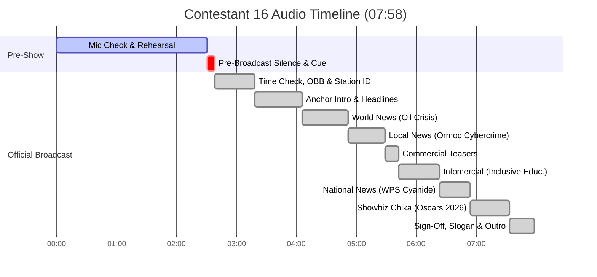

# Radio Broadcast Full Transcript — Contestant 16

## 📊 Broadcast & Recording Metadata

| Field | Value |
|---|---|
| **Audio File** | `NSPC-Samples/Contestant-16.mp3` |
| **Source Data** | `scratch_transcripts/Contestant-16.json` |
| **Contestant ID** | Contestant 16 |
| **Competition Event** | NSPC Radio Broadcasting & Scriptwriting (Filipino Medium) |
| **Total Audio Duration** | 07:58 (478.84 seconds) |
| **Language** | Filipino / Tagalog, English (Taglish) |
| **Station Callsign & Frequency** | DCJT 91.26 *(also spoken/heard as DCJT 91.26 / NSPC Patrol)* |
| **Program Title** | NSPC Patrol |
| **Broadcast Date & Setting** | Miyerkules, Abril 15, 2026 / Ormoc City *(City of Beautiful People)* |
| **Section Breakdown** | • **Section 1: Mic Check & Technical Rehearsal:** `00:00 - 02:31` (150.68s) • **Section 2: Pre-Broadcast / Studio Standby:** `02:31 - 02:38` (7.90s) • **Section 3: Actual Radio Broadcast:** `02:38 - 07:58` (320.26s) |

---

## 👥 Production Team & Speaker Roster

| Role / Speaker Label | Identified Name | Function & Key Assignments |
|---|---|---|
| **ANCHOR 1 (Lead Anchor)** | Louie de Vera | Main Lead News Anchor (Male) — Program intro, headlines, news hand-offs, commercial teaser, closing sign-off |
| **ANCHOR 2 (Co-Anchor)** | Lian Calmoring *(Lian Calmoni / Kan-Morin)* | Co-Anchor (Female) — Program intro, date spiel, headlines, local news hand-off, closing sign-off |
| **NEWSCASTER 1** | Ron Rivera | World & Energy News Reporter — Global oil supply crunch, Middle East conflict & Trump-Iran negotiations |
| **NEWSCASTER 2** | Joshua Casilla *(Joshua Asila)* | Local Crime Reporter — Ormoc City entrapment operation & illegal financial accounts/ATM selling arrest |
| **NEWSCASTER 3** | Angel Dapito *(or Newscaster / Field Reporter)* | National / Maritime Reporter — West Philippine Sea Chinese fishing vessel cyanide damage report |
| **SHOWBIZ REPORTER** | Aya Esteban *(Aya Esteba)* | Showbiz & Entertainment Reporter — Academy Awards / Oscars 2026 box office & nominations chika |
| **INFOMERCIAL VOICE 1** | Tatay Roli (Cast) | 65-year-old senior graduate under DepEd Alternative Learning System (ALS) |
| **INFOMERCIAL VOICE 2** | Lena (Cast) | Working student balancing employment and education through Open High School System |
| **INFOMERCIAL VOICE 3** | Malik / Balik (Cast) | Parent / Advocate representing special needs education and Filipino Sign Language (FSL) |
| **INFOMERCIAL ENSEMBLE** | Full Team Cast | Unified advocacy chorus: *"Edukasyon para sa lahat. Walang maiiwan, walang maiiwanan!"* |
| **TECHNICAL DIRECTOR** | Audio Board Operator / Team | Audio board operator, time check spiels, sound effects & background music bed cues |

---

## ⏱️ Structure & Timing Summary

| Section | Timestamp Range | Duration | Description |
|---|---|---|---|
| **Section 1: Mic Check & Technical Rehearsal** | `00:00 - 02:31` | 02:31 (150.68s) | Initial mic testing, counting, sound checks, practice disaster infomercial script, team roll call, and teaser/chant rehearsals |
| **Section 2: Pre-Broadcast / Studio Standby** | `02:31 - 02:38` | 00:07 (7.90s) | Studio room tone, technical preparation, silence awaiting official broadcast go-signal |
| **Section 3: Actual Radio Broadcast** | `02:38 - 07:58` | 05:20 (320.26s) | Official competitive radio broadcast performance starting with Philippine time check and station ID through final extro |

---

## 📜 Full Verbatim Transcript

### SECTION 1: MIC CHECK & TECHNICAL REHEARSAL [00:00 - 02:31]

`[00:00 - 00:04]`  
**ANCHOR 1 (Louie de Vera):** Hello. Hello. Mic test, 1, 2, 3. *(Whisper transcription: "My sister. One, two, three.")*

`[00:05 - 00:06]`  
**ANCHOR 2 (Lian Calmoring):** Mic test.

`[00:07 - 00:07]`  
**TEAM MEMBER:** Hello.

`[00:07 - 00:09]`  
**TEAM MEMBER:** Sound check. Sound check.

`[00:12 - 00:15]`  
**ANCHOR 1 (Louie de Vera):** Ito ay test broadcast... lamang.

`[00:15 - 00:23]`  
*[AUDIO: BRIEF STUDIO PAUSE / PREPARATION]*

`[00:23 - 00:29]`  
**INFOMERCIAL VOICE (Practice):** Nakinakala [Akala] ng mga taga-Ormoc City na isa lamang pangkaraniwang maulang umaga.

`[00:29 - 00:33]`  
**INFOMERCIAL VOICE (Practice):** Ang ilan ay nanatili sa loob ng kanilang tahanan.

`[00:34 - 00:36]`  
**INFOMERCIAL VOICE (Practice):** May simpatang nakula. [May simpleng pag-ulan...]

`[00:37 - 00:40]`  
**INFOMERCIAL VOICE (Practice):** Sun ay hindi na tahimik at walang kamalay-malay.

`[00:40 - 00:43]`  
**INFOMERCIAL VOICE (Practice):** Sa kula. [Sa baha...]

`[00:43 - 00:52]`  
**INFOMERCIAL VOICE (Practice):** Sa kliper... [unclear audio / microphone test]

`[00:55 - 00:58]`  
**INFOMERCIAL VOICE (Practice):** Na parang nabuhalang warasang kumawala. [Na parang nagwawalang tubig na kumawala...]

`[00:58 - 00:59]`  
**INFOMERCIAL VOICE (Practice):** Tinakay [Tinangay] ang mga kabahayan.

`[01:00 - 01:03]`  
**INFOMERCIAL VOICE (Practice):** Sa saulong na nag-miss po lang. [Sa sulok ng...]

`[01:03 - 01:07]`  
**INFOMERCIAL VOICE (Practice):** Buta meron ang buwan. Ang buwan ito rin.

`[01:08 - 01:13]`  
**INFOMERCIAL VOICE (Practice):** Ngunit naman silang kinagubit ng trahedya. [Ngunit nang sila'y ginupo ng trahedya,]

`[01:13 - 01:15]`  
**INFOMERCIAL VOICE (Practice):** Hindi tuluyang nalulog. [Hindi tuluyang nalugmok.]

`[01:15 - 01:21]`  
**INFOMERCIAL VOICE (Practice):** Atinwak at puno rin sa ulo. [unclear phrase]

`[01:21 - 01:28]`  
*[AUDIO: BRIEF STUDIO PAUSE / STATION SPIEL REHEARSAL SETUP]*

`[01:28 - 01:30]`  
**ANCHOR 1 (Louie de Vera):** ...na naririnig sa himpapawid.

`[01:30 - 01:35]`  
**ANCHOR 2 (Lian Calmoring):** May mga boses na handang maglingkod at maghatid ng impormasyon sa bawat pagpapalabas.

`[01:35 - 01:37]`  
**ANCHOR 1 (Louie de Vera):** Sila ang tinig ng katotohanan.

`[01:37 - 01:38]`  
**ANCHOR 2 (Lian Calmoring):** Ilaw ng komunikasyon.

`[01:39 - 01:41]`  
**ANCHOR 1 (Louie de Vera):** At lakas ng ating estasyon.

`[01:41 - 01:43]`  
**ANCHOR 2 (Lian Calmoring):** Sinalali natin ang ating pangangasal. [Sama-sama nating harapin ang balitaan...]

`[01:43 - 01:44]`  
**ANCHOR 1 (Louie de Vera):** Sama sa balitaan...

`[01:44 - 01:47]`  
**TEAM ENSEMBLE:** ...sa NSPC Patrol!

`[01:48 - 01:49]`  
**NEWSCASTER 2:** Joshua Casilla.

`[01:50 - 01:51]`  
**SHOWBIZ REPORTER:** Aya Esteban.

`[01:51 - 01:52]`  
**NEWSCASTER 1:** Ron Rivera.

`[01:53 - 01:54]`  
**NEWSCASTER 3:** Angel Dapito.

`[01:55 - 01:57]`  
**ANCHOR 1 (Louie de Vera):** Kasama ang inyong mga tagapagbalita, Louie de Vera...

`[01:57 - 01:59]`  
**ANCHOR 2 (Lian Calmoring):** ...at Lian Calmoring.

`[01:59 - 02:00]`  
**ANCHOR 1 (Louie de Vera):** Mula sa puso...

`[02:00 - 02:01]`  
**ANCHOR 2 (Lian Calmoring):** ...para sa bayan...

`[02:02 - 02:04]`  
**TEAM ENSEMBLE:** ...mananagumpay sa inyo, Pilipinas!

`[02:06 - 02:09]`  
**NEWSCASTER (Practice):** Nagkakagulo po naman ang maraming rallyista ngayon dito sa...

`[02:09 - 02:13]`  
**NEWSCASTER (Practice):** Sumirit ang presyo ng langis dahil sa...

`[02:13 - 02:18]`  
**NEWSCASTER (Practice):** Naging banta sa buhay ng mga mangingisda ang patuloy na panggugulo ng monster ship ng China.

`[02:18 - 02:22]`  
**NEWSCASTER (Practice):** Kung wala raw pag-iikot ang mga taong nasasangkot sa anomalya at korapsyon:

`[02:23 - 02:25]`  
**TEAM ENSEMBLE (Chant):** Ikulong na 'yan!

`[02:25 - 02:27]`  
**TEAM ENSEMBLE (Chant):** Mga kurakot!

`[02:27 - 02:28]`  
**TEAM ENSEMBLE (Chant):** Ikulong na 'yan!

`[02:29 - 02:30]`  
**TEAM ENSEMBLE (Chant):** Mga kurakot!

---

### SECTION 2: PRE-BROADCAST / STUDIO STANDBY [02:31 - 02:38]

`[02:31 - 02:38]`  
*[AUDIO: STUDIO ROOM TONE / TECHNICAL CUES & COUNTDOWN STANDBY]*

---

### SECTION 3: ACTUAL RADIO BROADCAST [02:38 - 07:58]

`[02:38 - 02:45]`  
**TECHNICAL DIRECTOR / TIME CHECK VOICE:**  
Oras nang Pilipinas: 4:06 ng hapon. At magsisimula na ang NSPC Patrol!

`[02:46 - 03:12]`  
*[AUDIO: FAST-PACED UPBEAT OPENING THEME BED SWELLS UP]*  
*[SFX: STATION STINGER / DRUM ACCENTS]*

`[03:12 - 03:15]`  
**STATION ID VOICE / ENSEMBLE:**  
DCJT 91.26! NSPC Patrol!

`[03:15 - 03:18]`  
*[AUDIO: NEWS BED SWELLS THEN DUCKS UNDER SPEECH]*

`[03:18 - 03:25]`  
**ANCHOR 1 (Louie de Vera):**  
Isang mapagpalang araw, Luzon, Visayas, at Mindanao! Maayong adlaw, Ormoc City!

`[03:25 - 03:29]`  
**ANCHOR 2 (Lian Calmoring):**  
Araw ng Miyerkules, April 15, 2026.

`[03:29 - 03:32]`  
**ANCHOR 1 (Louie de Vera):**  
Kami ang inyong kagapay: Louie de Vera...

`[03:32 - 03:34]`  
**ANCHOR 2 (Lian Calmoring):**  
...at Lian Calmoring!

`[03:35 - 03:39]`  
**ANCHOR 2 (Lian Calmoring):**  
Tunay ngang mag-iinit dito sa City of Beautiful People, Partner Louie!

`[03:40 - 03:47]`  
**ANCHOR 1 (Louie de Vera):**  
Aba d'yan, Lian! Kaya naman kasabay ng mainit at agarang pamumukaw... narito na ang mga primerang balita ngayon!

`[03:47 - 03:51]`  
*[SFX: HEADLINE STINGER / BEEP]*

`[03:51 - 03:54]`  
**ANCHOR 1 (Louie de Vera):**  
Presyo ng langis sa Pilipinas, muling nagka-kakulangan sa supply!

`[03:54 - 03:55]`  
*[SFX: STINGER]*

`[03:55 - 03:59]`  
**ANCHOR 2 (Lian Calmoring):**  
Iligal na pagbebenta ng financial accounts, nabisto ng pulisya!

`[03:59 - 04:03]`  
**ANCHOR 1 (Louie de Vera):**  
Simulan na natin ang pagroda sa mga balita!

`[04:03 - 04:06]`  
*[AUDIO: NEWS BED UP AND UNDER]*

`[04:06 - 04:16]`  
**ANCHOR 2 (Lian Calmoring):**  
Nagbabahala ang global oil markets dahil sa pagbulusok ng supply ng langis dahilan ng pagtaas ng presyo nito. Para sa balita, rumoroda si Ron Rivera!

`[04:16 - 04:35]`  
**NEWSCASTER 1 (Ron Rivera):**  
Sumirit na sa 43% ang dagdag sa presyo ng langis dahil sa gulong nangyayari sa Middle East. Pahirapan na kasing makalusot sa Hormuz ang mga barkong nag-aangkat ng petrolyo. Dahil dito, apektado ang ekonomiya ng buong mundo dahil sa pagtaas ng inflation rate. Ron Rivera, para sa NSPC Patrol!

`[04:36 - 04:39]`  
**ANCHOR 1 (Louie de Vera):**  
Ron, ano na kaya ang lagay ng giyera sa Middle East?

`[04:39 - 04:49]`  
**NEWSCASTER 1 (Ron Rivera):**  
Louie, ayon kay US President Donald Trump, naging maayos ang naging pag-uusap nila ng Iran at binigyan niya ang mga ito ng sampung araw na palugit para makipagnegosasyon.

`[04:49 - 04:51]`  
**ANCHOR 1 (Louie de Vera):**  
Maraming salamat, Ron!

`[04:51 - 04:54]`  
*[SFX: TRANSITION STINGER]*

`[04:54 - 05:02]`  
**ANCHOR 2 (Lian Calmoring):**  
Samantala, timbog ang isang lalaki matapos lumabag sa anti-financial accounts scheme sa isang lugar sa Leyte. Eksklusibong nakatutok d'yan si Joshua Casilla!

`[05:02 - 05:28]`  
**NEWSCASTER 2 (Joshua Casilla):**  
Himas-rehas ngayon ang 29-year-old na lalaki na kinilalang alyas Samboy sa isang nagawang entrapment operation ng pulisya sa Ormoc City, Leyte. Nahuli siyang iligal na nagbebenta online ng financial accounts gamit ang ATM na seryosong paglabag sa Cybercrime Prevention Act of 2012. Hinihikayat naman ng awtoridad ang publiko na mag-report agad kung makararanas ng ganitong transaksyon online. Para sa bayang sinilangan, Joshua Casilla!

`[05:28 - 05:30]`  
*[SFX: TRANSITION SOUND EFFECT]*

`[05:30 - 05:31]`  
**ANCHOR 1 (Louie de Vera):**  
Up next sa pagbabalik!

`[05:31 - 05:32]`  
**ANCHOR 2 (Lian Calmoring):**  
Susunod!

`[05:32 - 05:37]`  
**ANCHOR 1 (Louie de Vera):**  
Ano-anong films kaya ang nakakuha ng maraming awards sa film competition ngayong 2026?

`[05:38 - 05:40]`  
**ANCHOR 2 (Lian Calmoring):**  
Tutok lang sa NSPC Patrol!

`[05:40 - 05:42]`  
*[AUDIO: COMMERCIAL BUMPER JINGLE / INFOMERCIAL BED UP]*

`[05:42 - 05:49]`  
**INFOMERCIAL VOICE 1 (Tatay Roli):**  
Ako si Tatay Roli, 65 years old. Sa tulong ng Alternative Learning System, nakapagtapos ako ng sekundarya at nakapag-aral pa sa kolehiyo.

`[05:50 - 06:01]`  
**INFOMERCIAL VOICE 2 (Lena):**  
Ako naman si Lena, isang working student. Hati ang oras ko sa pag-aaral. Mabuti na lang at mayroong Open High School! Makakapagtapos ako habang tinutugunan ko ang problemang pinansyal.

`[06:01 - 06:12]`  
**INFOMERCIAL VOICE 3 (Malik):**  
Ako si Malik, may anak na may espesyal na pangangailangan. Sa tulong ng Filipino Sign Language at pagpapatupad nito sa paaralan, nakapag-aral siya nang payapa at kayang makihalubilo sa ibang tao.

`[06:12 - 06:18]`  
**INFOMERCIAL ENSEMBLE:**  
May iba't ibang kwento at antas, pero iisa ang pangarap: Edukasyon para sa lahat.

`[06:18 - 06:21]`  
**INFOMERCIAL ENSEMBLE:**  
Walang maiiwan. Walang maiiwanan!

`[06:21 - 06:23]`  
*[AUDIO: INFOMERCIAL OUTRO / STATION BUMPER BED]*

`[06:23 - 06:24]`  
**ANCHOR 1 (Louie de Vera):**  
Balik-balita tayo!

`[06:24 - 06:26]`  
*[SFX: NEWS STINGER]*

`[06:26 - 06:53]`  
**NEWSCASTER 3 (Angel Dapito):**  
Naiulat ang kapansin-pansing cyanide mula sa mga Chinese fishing vessel na pumapatay sa mga bahura at sinisira ang karagatan ng Pilipinas. Dahil dito, nais paigtingin ng National Security Council ang pagbabantay sa West Philippine Sea para maiwasan ang pinsala sa kalikasan. Kaugnay pa rin nito ang patuloy na pang-aangkin ng China sa West Philippine Sea kahit nakasaad sa international ruling na wala silang legal na batayan. Sa ngayon ay wala pang pahayag ang China tungkol sa insidente.

`[06:53 - 06:54]`  
*[SFX: SHOWBIZ STINGER / UPBEAT POP BED]*

`[06:54 - 07:33]`  
**SHOWBIZ REPORTER (Aya Esteban):**  
Kaaya-ayang balita! Para sa mga film lovers d'yan, lumabas na ang resulta ng Academy Awards at Oscar Nominations na hinihintay n'yo! Umabot sa 180 million dollars ang kita ng films globally, at nakakuha ng maraming boto sa this year's Academy Awards kabilang na ang One Battle After Another, Sinners, at iba pa mula sa mga tao. Super unpredictable nga ng results dahil sa kabila ng maraming nominations na nakuha ng ibang films ay hindi pa rin sila ang winner. Kaya abangan ang iba't ibang films na mapapanood sa buong mundo! 'Yan muna tara, ito si Aya para sa kaaya-ayang balita!

`[07:33 - 07:35]`  
**ANCHOR 2 (Lian Calmoring):**  
At 'yan ang mga balita ngayong araw!

`[07:35 - 07:39]`  
**ANCHOR 1 (Louie de Vera):**  
Sa mundong binabaha ng impormasyon, hindi sapat ang makinig...

`[07:39 - 07:40]`  
**ANCHOR 2 (Lian Calmoring):**  
...maging mapanuri!

`[07:40 - 07:41]`  
**ANCHOR 1 (Louie de Vera):**  
Hindi sapat ang malaman...

`[07:41 - 07:42]`  
**ANCHOR 2 (Lian Calmoring):**  
...maging mapanindigan!

`[07:43 - 07:45]`  
**ANCHOR 1 (Louie de Vera):**  
At sa bawat salita, maging mapanagutan...

`[07:45 - 07:48]`  
**ANCHOR 2 (Lian Calmoring):**  
...dahil ang katotohanan, pinaninindigan!

`[07:48 - 07:52]`  
**ANCHOR 1 & ANCHOR 2 / TEAM ENSEMBLE:**  
Kaya patuloy pa ring lalaya ang malayang mamamayan!

`[07:52 - 07:58]`  
*[AUDIO: OUTRO MUSIC BED SWELLS UP, STATION CHIME / STINGER, FADES OUT TO END]*
