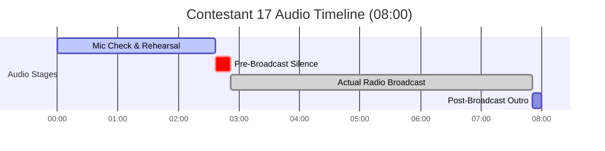

# Contestant 17 - Full Audio Transcript

## 📊 Metadata & Audio Information

| Field | Value |
|---|---|
| **Audio File** | `NSPC-Samples/Contestant-17.mp3` |
| **Source Data** | `scratch_transcripts/Contestant-17.json` |
| **Contestant ID** | Contestant 17 |
| **Competition Event** | NSPC Radio Broadcasting & Scriptwriting (Filipino Medium) |
| **Total Audio Duration** | 08:00 (480.05 seconds) |
| **Language** | Filipino / Tagalog, English, Bisaya/Cebuano (Taglish) |
| **Station Name / Callsign** | NSPC Patrol *(Radyo Patrol)* |
| **Program Title** | NSPC Patrol |
| **Station Origin / Locality** | Ormoc City (*"City of Beautiful People"*, *"Green Pineapple of the Philippines"*) |
| **Section Breakdown** | • **Section 1: Mic Check & Rehearsal:** `00:00 - 02:37` (157.19s) • **Section 2: Pre-Broadcast / Transition:** `02:37 - 02:52` (15.37s) • **Section 3: Actual Radio Broadcast:** `02:52 - 07:51` (298.21s) • **Section 4: Post-Broadcast Silence / Outro:** `07:51 - 08:00` (9.28s) |

---

## 👥 Speaker Roster & Team Members

| Speaker Label | Identified Name | Stated Role / Function |
|---|---|---|
| **ANCHOR 1** | Ivan Galupo *(heard as Yvonne Ganupong / Ivan Galupo)* | Lead News Anchor (Male) — Program opening, headlines, WPS cyanide story, commercial teasers, closing sign-off |
| **ANCHOR 2** | Xianne Colipano *(heard as Yang Golemano / Xianne Colipano)* | Co-Anchor (Female) — Program opening, headlines, WPS NSC report, crude oil intro, showbiz intro, closing sign-off |
| **NEWSCASTER 1** | Kian Sandido *(heard as Kian Sandino / Kian Sandido)* | World / Economic News Presenter — Crude oil price surge in the United States and Middle East tensions |
| **SPORTSCASTER** | Lloyd Bayon *(heard as Lloyd Bayo / Lloyd Bayon)* | Sports News Presenter — Tennis player Francis Casey Alcantara stranded at ATP Challenger Fujairah Open |
| **SHOWBIZ REPORTER** | Zal Ramos *(heard as Zauramos / Zal Ramos)* | Showbiz News Presenter (*"Standby sa Chikahan"*) — 98th Oscars / Timothée Chalamet & Michael B. Jordan (*Sinners*) |
| **INFOMERCIAL SPECIALIST** | Rainier Leala *(heard as Rainier Liala / Rainier Leala)* | Developmental Infomercial Lead / Narrator — Wildlife & Forest Protection (Philippine Eagle habitat loss & DENR advisory) |
| **INFOMERCIAL VOICE 1** | Team Cast / Roy Quemado | Infomercial Cast / Science Volunteer — Dialogue on looking for Philippine Eagle |
| **TECHNICAL DIRECTOR** | Chandric Baharon *(heard as Chandric / Jendric Baharon)* | Technical Director — Audio board operator, music beds, stingers, and sound effects cues |
| **FLOOR DIRECTOR / TIMER** | Production Floor Manager | Studio Countdown & Cues — Timing warnings (*"One minute"*, *"Twenty seconds. Silence on set. Countdown"*, *"In 10, 9, 8..."*) |
| **STATION ENSEMBLE** | Full Team | Station ID Stingers & Slogans (*"NSPC Patrol!"*, *"Tatak-totoo!"*, *"Magandang araw, Pilipinas!"*) |

---

## ⏱️ Structure & Timing Summary

| Section | Timestamp Range | Duration | Description |
|---|---|---|---|
| **Section 1: Mic Check & Technical Setup** | `00:00 - 02:37` | 02:37 (157.19s) | Microphone level testing, counting, sound checks, team role call, practice spiels, headline rehearsals, and 1-minute cue |
| **Section 2: Pre-Broadcast / Transition** | `02:37 - 02:52` | 00:15 (15.37s) | Studio silence on set, floor manager countdown (*"20 seconds. Silence on set... In 10, 9, 8, 7, 6..."*), standby for broadcast |
| **Section 3: Actual Radio Broadcast** | `02:52 - 07:51` | 04:59 (298.21s) | Complete formal radio broadcasting competition performance from station OBB/ID to final sign-off |
| **Section 4: Post-Broadcast Outro / Room Tone** | `07:51 - 08:00` | 00:09 (9.28s) | Music fade-out, studio room tone, and recording completion |

---

## 📝 Complete Verbatim Transcript

### Section 1: Mic Check & Technical Rehearsal [00:00 - 02:37]

`[00:00 - 00:02]`  
**ANCHOR 1 / TEAM:** Mic check. Mic testing. Mic testing. Mic check.

`[00:02 - 00:05]`  
**ANCHOR 2 / TEAM:** Check 1, 2, 3. 1, 2, 3.

`[00:05 - 00:06]`  
**TEAM MEMBER:** Last.

`[00:05 - 00:06]`  
**TEAM MEMBER:** Totoo.

`[00:06 - 00:07]`  
**TEAM MEMBER:** Hatid. [Hadid.]

`[00:07 - 00:08]`  
**TEAM MEMBER:** Hatid. [Hadid.]

`[00:08 - 00:08]`  
**TEAM MEMBER:** Totoo.

`[00:09 - 00:10]`  
**TEAM MEMBER:** Bawat pangyayari... [Bawat pangyayag.]

`[00:11 - 00:11]`  
**TEAM MEMBER:** Totoo.

`[00:11 - 00:12]`  
**TEAM MEMBER:** Totoo.

`[00:12 - 00:12]`  
**TEAM MEMBER:** What now?

`[00:13 - 00:14]`  
**TEAM MEMBER:** Ipanalo. [Ipanong.]

`[00:14 - 00:14]`  
**TEAM MEMBER:** Ipanalo. [Ipanong.]

`[00:14 - 00:16]`  
**STATION ID ENSEMBLE:** Ang NSPC Patrol! [Ang NSPC patroli.]

`[00:27 - 00:28]`  
**TEAM MEMBER:** Totoo.

`[00:28 - 00:37]`  
**TEAM MEMBER:** Mic test.

`[00:37 - 00:37]`  
**FLOOR DIRECTOR / TD:** Start.

`[00:38 - 00:38]`  
**FLOOR DIRECTOR / TD:** Both.

`[00:38 - 00:45]`  
**ANCHOR 1 (Ivan Galupo):** Ayan, magandang araw po sa inyo! [Ayan, magandang araw po sila.]

`[00:45 - 00:48]`  
**ANCHOR 1 (Ivan Galupo):** Hataw po ang inyong Anchor 1, Ivan Galupo. [Hata ko po ang inyong Anchor 1, Yvonne Ganupong.]

`[00:48 - 00:51]`  
**ANCHOR 2 (Xianne Colipano):** Hello, hello, City of Beautiful People!

`[00:51 - 00:53]`  
**ANCHOR 2 (Xianne Colipano):** Well, maayong hapon Ormoc!

`[00:53 - 00:57]`  
**ANCHOR 2 (Xianne Colipano):** Ako naman po ang inyong Anchor 2, Xianne Colipano. [Yang Golemano.]

`[00:57 - 01:00]`  
**NEWSCASTER 1 (Kian Sandido):** News Presenter 1 [News Proceptor 1], Kian Sandido. [Kian Sandino.]

`[01:00 - 01:01]`  
**NEWSCASTER 1 (Kian Sandido):** Tatak-totoo! [Tap-tap, totoo.]

`[01:02 - 01:04]`  
**NEWSCASTER 1 (Kian Sandido):** Sumipa sa may higit... dolyar, bawat gallon... [Sumi pa sa may higitang dolyan, bawat ganun.]

`[01:05 - 01:08]`  
**SPORTSCASTER (Lloyd Bayon):** Ikalawang broadcaster, Lloyd Bayon. [Lloyd Bayo.]

`[01:08 - 01:09]`  
**SPORTSCASTER (Lloyd Bayon):** Tatak-totoo! [Tap-tap, totoo.]

`[01:10 - 01:13]`  
**SPORTSCASTER (Lloyd Bayon):** Matapos iwanko si Alcantara sa qualifying rounds... [Matapos yung kusya, ikantara sa qualifying rounds.]

`[01:14 - 01:16]`  
**SHOWBIZ REPORTER (Zal Ramos):** News Presenter 3 [News Proceptor 3], Zal Ramos. [Zauramos.]

`[01:17 - 01:18]`  
**SHOWBIZ REPORTER (Zal Ramos):** Ang pelikulang pinagbidahan... [Ang pinipulang pinagbidahan.]

`[01:20 - 01:22]`  
**INFOMERCIAL SPECIALIST (Rainier Leala):** Infomercial Specialist, Rainier Leala. [Rainier Liala.]

`[01:23 - 01:24]`  
**INFOMERCIAL SPECIALIST (Rainier Leala):** Goodness gracious!

`[01:25 - 01:29]`  
**INFOMERCIAL SPECIALIST (Rainier Leala):** Paano kung nagmahal ka ng taong bawal mahalin niyo? [Paano kung nagmahal ka ng taong pangwal, mahalin niyo?]

`[01:30 - 01:33]`  
**ANCHOR 1 / ENSEMBLE:** Kasama ang aming Technical Director, Chandric Baharon.

`[01:35 - 01:39]`  
**ANCHOR 1 (Ivan Galupo):** Ayan, kapit lang po dahil aarangkada na ang Radyo Patrol! [radio patrol.]

`[01:41 - 01:46]`  
**ANCHOR 1 (Ivan Galupo):** *[Rehearsal spiel]* Bote-boteng cyanide na ginamit umano sa paglalason sa katubigan sa West Philippine Sea [Bote-bote sign ay naginamit mulo sa paglalasong sa katuligan sa West Philippine Sea]

`[01:46 - 01:49]`  
**ANCHOR 1 (Ivan Galupo):** *[Rehearsal spiel]* na nasamsam mula sa mga Chinese fishing vessels. [na sapsang mula sa mga Chinese fishing vessels.]

`[01:49 - 01:54]`  
**ANCHOR 2 (Xianne Colipano):** *[Rehearsal spiel]* Ah, presyo ng crude oil sa Estados Unidos umakyat na sa may higit isang daang dolyar [isang daang dolyan]

`[01:55 - 01:55]`  
**ANCHOR 2 (Xianne Colipano):** *[Rehearsal spiel]* bawat bariles. [Bada, barilis.]

`[01:56 - 01:56]`  
**FLOOR DIRECTOR / TIMER:** Okay, one minute.

`[01:57 - 01:57]`  
**FLOOR DIRECTOR / TIMER:** We're ready.

`[01:57 - 01:58]`  
**FLOOR DIRECTOR / TIMER:** Nine, two, three.

`[01:59 - 02:03]`  
**ANCHOR 1 (Ivan Galupo):** *[Rehearsal spiel]* Sa nagpapatuloy na tensyon sa pagitan ng China at Pilipinas sa West Philippine Sea, [Sa mga kapag-presidential sa pagitan ng China at Pilipinas sa West Philippine Sea,]

`[02:03 - 02:06]`  
**ANCHOR 1 (Ivan Galupo):** *[Rehearsal spiel]* nagkumpiska ang mga sundalong Pilipino mula sa mga Chinese fishing vessels... [nag-umpiska ng masyundarong Pilipino, Rasimanchari's Fishing Vessel.]

`[02:07 - 02:09]`  
**SPORTSCASTER (Lloyd Bayon):** *[Rehearsal spiel]* Matapos iwanko si Alcantara sa qualifying rounds, [Matapos yung kusya, ikantara sa qualifying rounds,]

`[02:10 - 02:12]`  
**SPORTSCASTER (Lloyd Bayon):** *[Rehearsal spiel]* tuluyang inihinto ang naturang torneo. [Tuloy na hinihinto ang naturang torneo.]

`[02:12 - 02:16]`  
**NEWSCASTER 1 (Kian Sandido):** *[Rehearsal spiel]* Sumipa sa may higit isang dolyar bawat galon ang presyo ng crude oil. [Sumiba sa may higit isang dolyan bawat kilo ng presyo ng crude oil.]

`[02:18 - 02:21]`  
**SHOWBIZ REPORTER (Zal Ramos) / INFOMERCIAL:** *[Rehearsal spiel]* Sa pelikulang pinagbidahan... Infomercial Specialist, Rainier Leala. [Sa pinipulang pinagbidahan, infomercial Specialist, Rainier Liala.]

`[02:22 - 02:24]`  
**SPORTSCASTER (Lloyd Bayon):** *[Rehearsal spiel]* Sa ngayon, patuloy na pinababantayan... [Sa ngayon, patuloy ng pinabantayan.]

`[02:25 - 02:27]`  
**ANCHOR 1 (Ivan Galupo):** *[Rehearsal spiel]* Sa nagpapatuloy na...

`[02:27 - 02:30]`  
**ANCHOR 1 (Ivan Galupo):** *[Rehearsal spiel]* ...tensyon sa pagitan ng China at Pilipinas sa West Philippine Sea. [...presidential sa pagitan ng China at Pilipinas sa West Philippine Sea.]

`[02:34 - 02:36]`  
**ANCHOR 2 (Xianne Colipano):** Maayong adlaw, silong sa Ormoc. [Mayong ataw, sunod sa umog.]

---

### Section 2: Pre-Broadcast / Transition [02:37 - 02:52]

`[02:37 - 02:43]`  
**FLOOR DIRECTOR / TIMER:** Twenty seconds. Silence on set. Countdown. [Twenty seconds. Silence concept. Countdown.]

`[02:44 - 02:51]`  
**FLOOR DIRECTOR / TIMER:** In ten, nine, eight, seven, six... [In ten, nine, eight, seven, six.]

`[02:51 - 02:52]`  
*[STUDIO SILENCE / FINAL STANDBY FOR ON-AIR BROADCAST]*

---

### Section 3: Actual Radio Broadcast [02:52 - 07:51]

`[02:52 - 03:08]`  
*[STATION OBB / THEME MUSIC BED / SFX]*  
**STATION ID VOICE / ENSEMBLE:** Mula sa sulok ng bansa hanggang sa bawat dako ng mundo, para sa sambayanang Pilipino. [Mula sa norong bahay ng abad ang bila bawat mundo para sa sambay ng Pilipino.]

`[03:09 - 03:11]`  
**STATION ID VOICE / ENSEMBLE:** Ito ang NSPC Patrol!

`[03:12 - 03:13]`  
**STATION ID VOICE / ENSEMBLE:** Tatak-totoo! [Tatak-toto.]

`[03:13 - 03:16]`  
*[NEWS THEME BED UP AND UNDER]*

`[03:16 - 03:17]`  
**ANCHOR 1 (Ivan Galupo):** Magandang araw!

`[03:17 - 03:19]`  
**ANCHOR 2 (Xianne Colipano):** Maayong adlaw, silong sa Ormoc! [Mahayong ataw, sunod sa umog.]

`[03:19 - 03:22]`  
**ANCHOR 1 (Ivan Galupo):** Ito ang inyong tagapagbalita, Ivan Galupo. [Ito ang inyong nagpagbalita, Ivan Ganungco.]

`[03:22 - 03:25]`  
**ANCHOR 2 (Xianne Colipano):** At Xianne Colipano. Narito na ang mga balita sa oras na ito. [At yan, Colipano. Narito na ang mga balita sa oras na ito.]

`[03:25 - 03:26]`  
*[HEADLINE BED / BEEP SFX]*

`[03:26 - 03:31]`  
**ANCHOR 1 (Ivan Galupo):** Bote-boteng cyanide na ginamit umano sa paglalason sa katubigan sa West Philippine Sea [Bote-bote side ay naging namin umulog sa paglalason sa katubigan sa West Philippine Sea]

`[03:31 - 03:34]`  
**ANCHOR 1 (Ivan Galupo):** na nasamsam mula sa mga Chinese fishing vessels. [na samsam mula sa mga Chinese fishing vessels.]

`[03:34 - 03:40]`  
**ANCHOR 2 (Xianne Colipano):** Presyo ng crude oil sa Estados Unidos, umakyat na sa may higit pitumpung dolyar [o higit isang daang dolyar] kada bariles. [Ah, presyo ng crude oil sa Estados Unidos umakyat na sa may higit isang dolyan kagabalilis.]

`[03:40 - 03:42]`  
**ANCHOR 1 (Ivan Galupo):** Simulan na ang balitaan! [Simlan na ang balitaan.]

`[03:42 - 03:44]`  
*[NEWS BED UP AND UNDER / STINGER]*

`[03:44 - 03:48]`  
**ANCHOR 1 (Ivan Galupo):** Sa nagpapatuloy na tensyon sa pagitan ng China at Pilipinas sa West Philippine Sea, [Sa nagpapatuloy ng tensyon sa pagitan ng China at Pilipinas sa West Philippine Sea,]

`[03:48 - 03:53]`  
**ANCHOR 1 (Ivan Galupo):** nakumpiska ng mga sundalong Pilipino mula sa mga Chinese fishing vessels ang sampung bote ng cyanide [nakupis ka ang mga sundalo ng Pilipino mula sa mga Chinese fishing vessels ang isang pungbote ng cyanide]

`[03:53 - 03:58]`  
**ANCHOR 1 (Ivan Galupo):** o nakalalasong kemikal na maaaring magdala ng panganib sa mga tao at marine ecosystems. [o nakalalasong kapital na maaaring magdala ng pangani sa mga tao at marine ecosystems.]

`[03:58 - 04:01]`  
**ANCHOR 2 (Xianne Colipano):** Ayon sa National Security Council o NSC, [Ayon, sa National Security Council o NSC,]

`[04:01 - 04:05]`  
**ANCHOR 2 (Xianne Colipano):** kinumpirmang positibo sa cyanide ang tubig sa paligid ng Ayungin Shoal [inakong pirmang positibo sa cyanide ang tubig sa paligid ng ayungisyo]

`[04:05 - 04:12]`  
**ANCHOR 2 (Xianne Colipano):** at maituturing umanong pansasabotahe ng China sa supply ng pagkain ng mga sundalo ng Hukbong Dagat. [at may tuturing umanong na pangsasabotahe ng China sa sublay ng pagkain ng mga sundalo ng hugong dagat.]

`[04:12 - 04:16]`  
**ANCHOR 1 (Ivan Galupo):** Sa kasalukuyan, plano nang magsumite ng ulat ang NSC sa Department of Foreign Affairs [Sa kasalukuyan, plano kong magsumitin ng kulak ang NSC sa Department of Foreign Affairs.]

`[04:17 - 04:18]`  
**ANCHOR 1 (Ivan Galupo):** bilang basehan para sa diplomatikong [Binangbas yan para sa diplomatik.]

`[04:18 - 04:21]`  
**ANCHOR 1 (Ivan Galupo):** protesta ng bansa kontra China. [I-protest ng bansa kontra China.]

`[04:21 - 04:22]`  
*[TRANSITION STINGER / FIELD BED]*

`[04:22 - 04:30]`  
**ANCHOR 2 (Xianne Colipano):** Samantala, pumalo sa halos anim na porsyento (6%) ang itinaas sa presyo ng crude oil sa Estados Unidos sa loob ng isang araw [Samantala, pumalo sa halos 6% ang itinaas sa presyo ng crude oil sa Estados Unidos sa loob ng isang araw.]

`[04:30 - 04:32]`  
**ANCHOR 2 (Xianne Colipano):** bunsod dito sa nangyayaring sigalot sa Gitnang Silangan. [Punso dito sa nangyayarang limaan sa gitang silangan.]

`[04:32 - 04:35]`  
**ANCHOR 2 (Xianne Colipano):** Para sa buong detalye, narito si Kian Sandido. [Para sa buong detalya na ito, si Kian Sandido.]

`[04:35 - 04:36]`  
*[FIELD REPORT BED UP AND UNDER]*

`[04:36 - 04:39]`  
**NEWSCASTER 1 (Kian Sandido):** Sumipa sa may pitumpung dolyar bawat galon ang presyo ng crude oil sa Amerika [Sumipang sa mga ikimang dolyan, bawat galon ang presyo ng crude oil sa Amerika]

`[04:39 - 04:43]`  
**NEWSCASTER 1 (Kian Sandido):** at nananatili namang nasa apat na dolyar bawat galon ang presyo ng gasolina. [at nananatili namang nasa 4 dolyan bawat galon ang presyo ng gasolina.]

`[04:43 - 04:47]`  
**NEWSCASTER 1 (Kian Sandido):** Resulta ito sa halos anim na porsyentong (6%) pagtaas sa presyo ng crude oil sa loob ng isang araw. [Risulta ito sa halos 6% pagtaas presyo ng crude oil sa loob ng isang araw.]

`[04:48 - 04:52]`  
**NEWSCASTER 1 (Kian Sandido):** Bagamat may pangamba ang Amerika sa inflation o bilis ng pagtaas sa presyo ng mga bilihin, [Magamit may panglambaang Amerika sa inflation o bilis ng pagtaas presyo ng mga bilihin,]

`[04:52 - 04:57]`  
**NEWSCASTER 1 (Kian Sandido):** tiniyak ni US President Donald Trump na maayos umano ang kanilang negosasyon sa Iran. [tiniyak ni US President Donald Trump na maayos umano ang kanilang negosasyon sa Iran.]

`[04:57 - 05:01]`  
**NEWSCASTER 1 (Kian Sandido):** Para sa NSPC Patrol, Kian Sandido, Tatak-totoo! [Para sa NSPC Patrol, Kian Sandido tatak-totoo.]

`[05:01 - 05:03]`  
*[COMMERCIAL BUMPER BED / STINGER]*

`[05:03 - 05:07]`  
**ANCHOR 1 (Ivan Galupo):** Mas marami pang mga balita sa pagbabalik ng NSPC Patrol! [Mas marami pang mga balita sa pagpapalit ng NSPC Patrol.]

`[05:08 - 05:11]`  
**ANCHOR 2 (Xianne Colipano):** Roy Quemado, handa ka na bang makisapi sa parihan? [Roy Kimades, handa na makaisaping sa parihan?]

`[05:11 - 05:14]`  
*[INFOMERCIAL BED / DRAMA SFX]*  
**INFOMERCIAL VOICE 1 (Roy Quemado):** Excited na akong makakita ng isang Philippine Eagle! [Excited na akong makikita ng isang science volunteer!]

`[05:14 - 05:18]`  
**INFOMERCIAL VOICE 2 / SPECIALIST (Rainier Leala):** Kung wala tayong makikita niyan, nanganganib na kasi ang populasyon nila. [Kung wala mo makikita tayo niyan, nangangalim ko siya ang populasyon nila.]

`[05:18 - 05:22]`  
*[DRAMATIC TRANSITION MUSIC / SFX]*

`[05:22 - 05:26]`  
**INFOMERCIAL NARRATOR (Rainier Leala):** Ayon sa DENR, nanganganib ang populasyon nila dahil sa habitat loss, [Ayon sa DENR, nangangalim ang populasyon nila dahil sa habitat laws,]

`[05:26 - 05:29]`  
**INFOMERCIAL NARRATOR (Rainier Leala):** talamak na deforestation at environmental degradation. [talagang deforestation at environmental degradation.]

`[05:29 - 05:33]`  
*[ADVOCACY JINGLE BED]*

`[05:33 - 05:39]`  
**INFOMERCIAL ENSEMBLE / JINGLE:** Ating alagaan ang kalikasan upang mga hayop [Ating alagaan, ang kaalikasan, upang magahayo.]

`[05:39 - 05:43]`  
**INFOMERCIAL ENSEMBLE / JINGLE:** ating matulungan. Ito'y paalala... [Ating mga tulungan, ito'y paalala.]

`[05:43 - 05:49]`  
**INFOMERCIAL ENSEMBLE / JINGLE:** Hindi lamang ito huwag kakalimutan, ganun din ang kagubatan. [Hindi lang lang ito, huwag kakalimutan, ganunin ang kabakanan.]

`[05:49 - 05:52]`  
*[STATION BUMPER / STINGER]*

`[05:52 - 05:55]`  
**ANCHOR 1 (Ivan Galupo):** Tuloy-tuloy pa rin ang balitaan dito sa NSPC Patrol! [Tuloy-tuloy pa rin ang balitaan dito sa NSPC Patrol.]

`[05:56 - 05:56]`  
**ANCHOR 2 (Xianne Colipano):** Tatak-tutok! [Tatak-tutok? / Tatak-totoo!]

`[05:56 - 05:58]`  
*[SPORTS THEME BED / STINGER]*

`[05:58 - 06:03]`  
**ANCHOR 1 (Ivan Galupo):** Sa ibang balita, stranded ngayon sa United Arab Emirates ang ating kababayang tennis player [Sa ipang balita, stranded ngayon si United Arab Emrys at ating kababayan tennis player,]

`[06:03 - 06:06]`  
**ANCHOR 1 (Ivan Galupo):** na si Francis Casey Alcantara matapos kanselahin [na si Francis E.C. Alcantara, matapos kinal sila.]

`[06:06 - 06:11]`  
**ANCHOR 1 (Ivan Galupo):** ang ATP Challenger Fujairah Open bunsod ng sigalot sa Gitnang Silangan. [Ang The AP Challenger 54 Chira Open, pulsod ng sigalot sa gitnang silangan.]

`[06:11 - 06:13]`  
**ANCHOR 1 (Ivan Galupo):** Lloyd Bayon para sa detalye. [Lloyd Bayon para sa litayin.]

`[06:13 - 06:14]`  
*[SPORTS BED UP AND UNDER]*

`[06:14 - 06:16]`  
**SPORTSCASTER (Lloyd Bayon):** Matapos iwanko si Alcantara sa qualifying rounds, [Matapos iwuko si Alcantara sa qualifying rounds,]

`[06:16 - 06:18]`  
**SPORTSCASTER (Lloyd Bayon):** tuluyang inihinto ang naturang torneo, [tuloy ang inito ang naturang torneo,]

`[06:19 - 06:22]`  
**SPORTSCASTER (Lloyd Bayon):** dulot ng apoy na sumiklab sa isang oil facility sa Fujairah [dulot ng apoy na sumiglab sa isang oil facility sa Fujairah,]

`[06:22 - 06:24]`  
**SPORTSCASTER (Lloyd Bayon):** sa gitna ng mga pag-atake sa Middle East. [sa gitna ng mga pag-atake sa Middle East.]

`[06:24 - 06:27]`  
**SPORTSCASTER (Lloyd Bayon):** Sa ngayon, patuloy na pinababantayan ng Philippine Sports [Sa ngayon, patuloy na pinabantayan ng Philippine Sports,]

`[06:27 - 06:32]`  
**SPORTSCASTER (Lloyd Bayon):** Commission o PSC ang kasalukuyang sitwasyon na magsisiguro sa kanyang ligtas na pagbalik. [kumisyon ng PSC ang kasalukuyang sitwasyon na magsisiguro sa kanyang ligtas na patuloy.]

`[06:33 - 06:37]`  
**SPORTSCASTER (Lloyd Bayon):** Para sa NSPC Patrol, Lloyd Bayon na tatak-tutok! [Para sa NSPC Patrol, Lloyd Bayon na tatak-tutok.]

`[06:37 - 06:38]`  
*[SHOWBIZ THEME BED / STINGER]*

`[06:38 - 06:43]`  
**ANCHOR 2 (Xianne Colipano):** Kaway-kaway, film lovers! Dahil iginawad na ang Oscar Academy Awards kagabi, [Kaway-kaway, film lovers, dahil ikinawad na ang Oscar Academy Awards kagabi,]

`[06:43 - 06:49]`  
**ANCHOR 2 (Xianne Colipano):** isang prestihiyosong awards ceremony para sa mga nangibabaw sa larangang pelikula ngayong taon. [isang prestigyosong awards ceremony para sa mga nangibabaw sa larangang pelikula ngayong doon.]

`[06:49 - 06:51]`  
**ANCHOR 2 (Xianne Colipano):** Zal Ramos, ano ang latest?

`[06:51 - 06:51]`  
*[SHOWBIZ BED UP AND UNDER]*

`[06:51 - 06:55]`  
**SHOWBIZ REPORTER (Zal Ramos):** Sa pelikulang pinagbidahan ni Timothee Chalamet na "Marty Supreme", [Sa pelikulang pinagbidahan ng Timotei Shami in the Party Supreme,]

`[06:55 - 06:57]`  
**SHOWBIZ REPORTER (Zal Ramos):** isang pelikula tungkol sa isang table tennis [isang pelikula tungkol sa isang table tennis.]

`[06:57 - 07:00]`  
**SHOWBIZ REPORTER (Zal Ramos):** at nang-explore na ng set ng 1950s New York, [At nang-exploder na nang-set ng 1950s New York,]

`[07:00 - 07:03]`  
**SHOWBIZ REPORTER (Zal Ramos):** bigo ang aktor na makuha ang Best Actor Award ng taon. [bigo ang aktor na makuha ang Best Actor Award ng taon.]

`[07:04 - 07:09]`  
**SHOWBIZ REPORTER (Zal Ramos):** Samantala, nangibabaw sa lahat ng mga nominado ang aktor na si Michael B. Jordan [Samantala nang-ibabaw sa lahat ng mga nominado ang aktor na si Michael B. Jordan]

`[07:09 - 07:14]`  
**SHOWBIZ REPORTER (Zal Ramos):** dahil nakamit niya ang Best Actor Award sa kanyang pelikulang "Sinners". [dahil na-commit niya ang Best Actor Award sa kanyang pelikulang Sinners.]

`[07:14 - 07:18]`  
**SHOWBIZ REPORTER (Zal Ramos):** Ako ang inyong standby sa chikahan, Zal Ramos, Tatak-totoo! [Ako ang inyong stunt kayo sa chikahan, Zal Ramos, Tatak Totoo.]

`[07:18 - 07:19]`  
*[OUTRO THEME BED UP AND UNDER]*

`[07:19 - 07:27]`  
**ANCHOR 1 (Ivan Galupo):** At 'yan ang mga balitang hatid namin sa oras na ito. [At yan ang mga balitang hatip namin sa oras nito.]

`[07:27 - 07:30]`  
**ANCHOR 2 (Xianne Colipano):** Mula sa silong ng Green Pineapple of the Philippines, [Mula sa silupay ng Green Pineapple of the Philippines,]

`[07:30 - 07:33]`  
**ANCHOR 2 (Xianne Colipano):** patuloy ang pagmamasid sa katotohanan. [patuloy ang pagmamatsyak sa katotohanan.]

`[07:33 - 07:38]`  
**ANCHOR 1 (Ivan Galupo):** Tatak-patrol, may malasakit at paninindigan sa bawat hamon ng panahon. [Tatak, parang mo, may malasakit at paningindigan sa bawat hamon ng panahon.]

`[07:38 - 07:40]`  
**ANCHOR 1 (Ivan Galupo):** Muli, ako si Ivan Galupo. [Muli ako, si Ivan Galupo.]

`[07:40 - 07:41]`  
**ANCHOR 2 (Xianne Colipano):** At Xianne Colipano. [At yan, Cory Pano.]

`[07:41 - 07:42]`  
**ANCHOR 1 (Ivan Galupo):** Maraming salamat. [Tatahang salamat.]

`[07:42 - 07:44]`  
**ANCHOR 2 (Xianne Colipano):** Ug maayong adlaw sa inyong tanan! [O maayong agaw sa inyong tanay.]

`[07:44 - 07:45]`  
**ANCHOR 1 (Ivan Galupo):** Ito ang...

`[07:46 - 07:47]`  
**STATION ENSEMBLE / STATION VOICE:** NSPC Patrol! [MSPC Bato.]

`[07:47 - 07:50]`  
**ANCHOR 1 & ANCHOR 2:** Magandang araw, Pilipinas! [Magandang araw at Pilipinas.]

---

### Section 4: Post-Broadcast Outro / Room Tone [07:51 - 08:00]

`[07:51 - 08:00]`  
*[OUTRO THEME BED FADES OUT / STUDIO ROOM TONE / RECORDING ENDS]*
