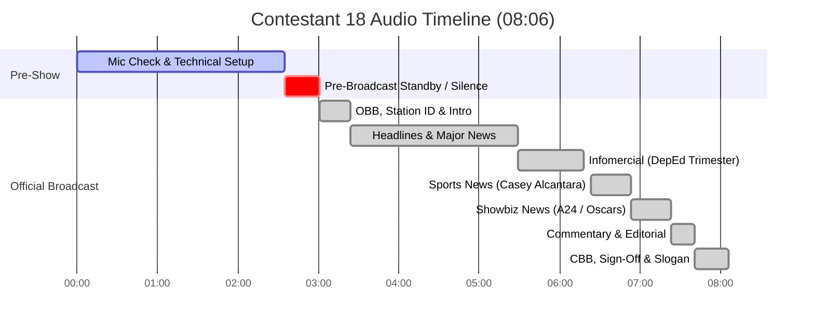

# Contestant 18 — Full Radio Broadcast Transcript

## 📊 Broadcast & Recording Metadata

| Field | Value |
|---|---|
| **Audio File** | `NSPC-Samples/Contestant-18.mp3` |
| **Source Segment Data** | `scratch_transcripts/Contestant-18.json` |
| **Contestant ID** | Contestant 18 |
| **Competition Event** | NSPC Radio Broadcasting & Scriptwriting (Filipino Medium) |
| **Total Audio Duration** | 08:06.60 (486.60 seconds) |
| **Language / Medium** | Filipino / Tagalog, English (Taglish), Regional Bisaya / Cebuano expressions (*"Kini ang inyong..."*, *"Ako ang inyong kauban sa pagbantay..."*, *"kauban sad nato sa technical side..."*, *"pagsulay"*, *"kakusog"*) |
| **Station Callsign & Frequency** | DCJV 91.26 *(spoken in sign-off: "Direk sa DCJV 91.26 NSPC Patrol")* |
| **Program Title** | NSPC Patrol |
| **Section Breakdown** | • **Section 1: Mic Check & Technical Setup:** `00:00 - 02:35` (155.00s) • **Section 2: Pre-Broadcast / Transition & Standby:** `02:35 - 03:01` (26.64s) • **Section 3: Actual Radio Broadcast:** `03:01 - 08:06` (304.12s / ~5:04 min) • **Section 4: Post-Broadcast Studio Silence:** `08:06 - 08:07` (0.84s) |

---

## ⏱️ Broadcast Structure & Timing Summary

| Section | Timestamp Range | Duration | Description |
|:---|:---:|:---:|:---|
| **SECTION 1: MIC CHECK & TECHNICAL SETUP** | `00:00 - 02:35` | 02:35 (155.00s) | Audio console initialization, microphone level adjustments, sound effects calibration, background music bed leveling, talent sound check |
| **SECTION 2: PRE-BROADCAST / TRANSITION** | `02:35 - 03:01` | 00:26 (26.64s) | Studio silence, talent in position, floor director cues, audio track arming, countdown to live broadcast |
| **SECTION 3: ACTUAL RADIO BROADCAST** | `03:01 - 08:06` | 05:05 (304.12s) | Official competitive radio broadcast performance (OBB, station ID, headline rundown, national & local news, DepEd infomercial, sports update, showbiz update, anchor commentary, CBB & sign-off) |
| **SECTION 4: POST-BROADCAST STUDIO SILENCE** | `08:06 - 08:07` | 00:01 (0.84s) | Studio room tone and end of recording |

---

## 👥 Production Cast & Speaker Roster

| Speaker Tag | Identified Talent Name | Role & Spoken Contribution |
|---|---|---|
| **ANCHOR 1 (Lead Anchor)** | Gia Ruzano | Lead News Anchor (Female) — Opening Billboard lead, station greeting, headlines, national news lead-in, commercial break teaser, station re-entry spiel, editorial commentary (*"Ang pagtaas ng presyo sa merkado..."*), closing extro (*"Kini ang inyong... Gia Ruzano!"*), station ID & sign-off |
| **ANCHOR 2 (Co-Anchor)** | Ron Cenia *(Ron Sinia)* | Co-Anchor (Male) — Station greeting, headline rundown, local news lead-in, Closing Billboard & sign-off (*"Walang preno, tuloy-tuloy, humaharap sa balitaan! Ako naman si Ron Cenia"*) |
| **NEWSCASTER 1** | Abby Managa *(Abby Manaog)* | National News Presenter — West Philippine Sea Spratly Islands Chinese fishing vessels cyanide seizure (*"Ako ang inyong NSPC Patroller, Abby Managa!"*) |
| **NEWSCASTER 2** | Ian Rama | Local News Presenter — Ormoc City Cyber Response Team entrapment of 29-year-old alias Samboy under AFASA / Cybercrime Act (*"Nakatutok sa balita, Ian Rama!"*) |
| **INFOMERCIAL CAST** | Infomercial Host / Quizmaster, Talent 1, Talent 2, Talent 3, Ensemble | Developmental PSA on DepEd Trimester System: Quiz game format (*"ano ang ibig sabihin ng acronym na DEPED?"*), comedic guesses, serious educational reform explanation, ensemble chant (*"Trimester na tayo! ... Sa Department of Education!"*) |
| **SPORTSCASTER** | Mitko Javier | Sports News Anchor / Reporter — Tennis news report on Filipino player Francis Casey Alcantara and the ATP Challenger 50 Fujairah Open in UAE (*"Ito ang inyong sports authority, Mitko Javier"*) |
| **SHOWBIZ REPORTER** | Radeven Ichi Camorra | Entertainment News Presenter — Showbiz update on movie studio A24 and the Academy Awards / Oscar nominations (*"Ito si Radeven for the showbiz update"*) |
| **TECHNICAL DIRECTOR** | Carl Amin | Audio Console Operator & Sound Engineer — Music bed mixing, sound effects, stingers, acknowledged on-air (*"kauban sad nato sa technical side si Carl Amin"*) |
| **STATION VOICE / ENSEMBLE** | Full Team Cast | Unified station slogan and sign-off (*"Direk sa DCJV 91.26 NSPC Patrol! Mabuhay ang magiting na radyo peryodistang Pilipino!"*) |

---

# 📜 Complete Verbatim Transcript

---

## SECTION 1: MIC CHECK & TECHNICAL SETUP [00:00 - 02:35]

**[00:00 - 00:32]**  
*[AUDIO: AUDIO CONSOLE INITIALIZATION, AMBIENT STUDIO ROOM TONE & MICROPHONE POSITIONING]*

**[00:32 - 00:40]**  
**ANCHOR 1 (Gia Ruzano - Practice):**  
Ito ang mga antabay sa bawat eksklusibong balita...  
*[Ito ang mga kabay sa bawat eksklusyong balita na mga balita.]*

**[00:40 - 00:47]**  
**ANCHOR / NEWSCASTER (Practice):**  
Nakalalasong likido na natagpuan sa Spratly Islands sa pakawala ng mga mangingisdang Tsino.  
*[Ang pagalasang dikilo na natagpuan sa Sparky Islands sa pakanaraw ng mga manginis ng Geno.]*

**[00:49 - 00:56]**  
**STATION ENSEMBLE (Practice):**  
Ito ang NSPC Patrol! Ito ang NSPC Patrol!  
*[Ito ang NSBC Patrol. Ito ang NSBC Patrol.]*

**[00:56 - 01:08]**  
**ANCHOR 1 (Gia Ruzano - Practice):**  
Kauban sad nato sa technical side si Carl Amin, direk sa DCJV 91.26 NSPC Patrol!  
*[Ito sa technical side si Carl Amin, diri sa BusyJV91.26 NSBC Patrol.]*

**[01:08 - 01:11]**  
**STATION ENSEMBLE (Practice):**  
Mabuhay ang magiting na peryodistang Pilipino!  
*[Maguhar ang manginis ng mga journalist ng Pilipino.]*

**[01:12 - 01:16]**  
**NEWSCASTER (Practice):**  
...Spratly Islands.  
*[Kung sa kutip, Sparky Islands.]*

**[01:17 - 01:50]**  
*[AUDIO: MUSIC BED LEVEL TESTING, SFX PLAYBACK CALIBRATION & SOUNDBOARD GAIN BALANCING]*

**[01:50 - 02:35]**  
**TEAM ENSEMBLE (Chant Practice):**  
*[Vocal warmup / rhythmic chant check]*

---

## SECTION 2: PRE-BROADCAST TRANSITION & STANDBY [02:35 - 03:01]

**[02:36 - 02:40]**  
**ANCHOR 1 (Gia Ruzano - Practice):**  
Ang inyong lingkod, Gia Ruzano.  
*[Ang inyong lingkod, di niya alusan.]*

**[02:41 - 02:51]**  
**INFOMERCIAL TALENT (Practice):**  
...ang bawat estudyante sa kani-kanilang paaralan...  
*[Ang bawat isyate sa kani, kanilang pahalaan...]*

**[02:51 - 02:55]**  
*[STUDIO SILENCE: TALENT IN POSITION, SCRIPTS READY, FLOOR DIRECTOR CUES]*

**[02:55 - 02:56]**  
*[STUDIO SILENCE: TECHNICAL DIRECTOR ARMS AUDIO TRACKS & CUES OPENING TAPE]*  
*(Acoustic silence marker: 175.25s - 176.46s)*

**[02:56 - 03:01]**  
*[STUDIO SILENCE: FINAL COUNTDOWN & STANDBY BEFORE LIVE BROADCAST]*

---

## SECTION 3: ACTUAL RADIO BROADCAST [03:01 - 08:06]

### PART 1: OPENING BILLBOARD (OBB), STATION ID & LEAD SPIEL [03:01 - 03:24]

`[03:01 - 03:10]`  
*[AUDIO: FAST-PACED UPBEAT OPENING THEME BED SWELLS UP TO FULL VOLUME]*  
*[SFX: STATION IMPACT STINGER]*  
**TIME CHECK / STATION VOICE:**  
Sa balitaan, oras natin ngayon ay tatlumpung minuto makalipas ang alas-kwatro ng hapon.  
*[makalupas-makalipas sa alas 4 ng hapon]*

`[03:10 - 03:13]`  
**ANCHOR 1 (Gia Ruzano):**  
Isang mapagpalang araw, Visayas at sa buong kapuluan ng Pilipinas!  
*[Isang mapapuling araw, bisayas at sa buong kapuluan ng Pilipinas.]*

`[03:13 - 03:16]`  
**ANCHOR 1 (Gia Ruzano):**  
Maayong hapon, dakbayan sa Ormoc!  
*[May hapon, dakbayan sa umong.]*

`[03:16 - 03:21]`  
**ANCHOR 2 (Ron Cenia):**  
Lalarga na naman ang tambalang hindi magpapaiwan, hindi magpapahuli sa paghahatid ng katotohanan.  
*[Raratsala na naman ang taba ng hindi magpapatina. Hindi magpapalain sa paghahatip ng katotohanan.]*

`[03:21 - 03:26]`  
**ANCHOR 1 (Gia Ruzano):**  
Sa bawat tahanan ng pamilyang Pilipino, nakaantabay sa bawat eksklusibong balitaan.  
*[Sa bawat tahanan ng pamilyang Pilipino, nagaantabay sa bawat eksklusibo balitaan.]*

`[03:26 - 03:29]`  
**ANCHOR 1 (Gia Ruzano):**  
Ako ang inyong lingkod, Gia Ruzano.  
*[Ako ang inyong lingkod, di niya alusan.]*

---

### PART 2: ANCHOR INTRODUCTIONS & TOP HEADLINES RUNDOWN [03:24 - 03:56]

`[03:29 - 03:33]`  
*[AUDIO: HEADLINE NEWS BED SWELLS THEN DUCKS UNDER SPEECH]*  
**ANCHOR 2 (Ron Cenia):**  
Walang preno, tuloy-tuloy, humaharap sa balitaan!  
*[Walang preno, tire-tiretso, humaharararang sa balitaan.]*

`[03:33 - 03:35]`  
**ANCHOR 2 (Ron Cenia):**  
Ako naman si Ron Cenia.  
*[Ako naman si Ron Sinia.]*

`[03:35 - 03:38]`  
**ANCHOR 2 (Ron Cenia):**  
Simulan na natin ang unang latag ng mga balita!  
*[Simulan na natin ang unang langtad ng mga balita.]*

`[03:40 - 03:45]`  
*[SFX: HEADLINE BEEP / IMPACT ACCENT]*  
**ANCHOR 1 (Gia Ruzano):**  
Nakalalasong likido na natagpuan sa Spratly Islands, pinakawalan ng mga mangingisdang Tsino!  
*[Nabakala sa mga likido na natagpuan sa Spartan Islands, pakadaraw ng mga manginis ng Chino.]*

`[03:45 - 03:50]`  
*[SFX: HEADLINE BEEP ACCENT]*  
**ANCHOR 2 (Ron Cenia):**  
Suspek sa iligal na pagbebenta ng financial accounts, nasa kustodiya ng pulisya!  
*[Suspect sa ilan na pagbibenta ng financial account, nasa kustodianan ng pulisya.]*

`[03:50 - 03:56]`  
*[SFX: HEADLINE BEEP ACCENT]*  
**ANCHOR 1 (Gia Ruzano):**  
ATP Challenger 50 Fujairah Open, naudlot! Pilipinong tennis player Francis Alcantara, hindi natuloy!  
*[ADP Challenger 50, Kujaira Open at Naudo. Pilipino Tennis Player Francis Alcantara, hindi natuloy yan.]*

---

### PART 3: MAJOR NEWS REPORTS (NATIONAL & LOCAL UPDATES) [03:56 - 05:29]

`[03:58 - 04:06]`  
*[AUDIO: NATIONAL NEWS BED SWELLS BRIEFLY, THEN DUCKS UNDER SPEECH]*  
**ANCHOR 1 (Gia Ruzano):**  
Para sa unang roda ng balita, kasunod ng patuloy na tensyon sa West Philippine Sea, China nagbuhos umano ng cyanide sa Spratly Islands.  
*[Para sa unang roda ng balita, kasunod ng patuloy na tensyon sa West Philippine Sea, China nagbuhos umanong ng cyanide sa Spartan Islands.]*

`[04:06 - 04:08]`  
**ANCHOR 1 (Gia Ruzano):**  
Tinutukan 'yan ni Abby Managa!  
*[Tinutukan niya ni Abby Managa.]*

`[04:08 - 04:25]`  
*[AUDIO: FIELD REPORT BED UP AND UNDER]*  
**NEWSCASTER 1 (Abby Managa):**  
Nababahala sa tubig ng Spratly Islands sa West Philippine Sea, ang cyanide na pinaniniwalaang ibinuhos umano ng mga mangingisdang Tsino, matapos makumpiska ng mga sundalong Pilipino ang sampung bote ng cyanide mula sa mga bangkang pangisda mula sa Chinese fishing vessels.  
*[Nabiskubi sa tubig ng Spartan Islands sa West Philippine Sea, ang cyanide na pinaninibalaang ng anumano. Sa mga manginis ng Chino, matapos makumpiska na mga Pilipino sundalo ang sampung bote ng cyanide mula sa mga bangkang ilulusan. Mula sa Chinese Fishing Vessels.]*

`[04:25 - 04:33]`  
**NEWSCASTER 1 (Abby Managa):**  
Kasunod nito, mas paiigtingin ng Armed Forces of the Philippines at Philippine Coast Guard ang pagbabantay sa naturang lugar.  
*[Kasunod ito, mas paiitingin ng Armed Forces of the Philippines at Philippine Coast Guard ang magbabantay sa natuwang luba.]*

`[04:33 - 04:37]`  
**NEWSCASTER 1 (Abby Managa):**  
Ako ang inyong NSPC Patroller, Abby Managa!  
*[Ako, ang inyong NSPC Part-Troller, Abby Managa.]*

`[04:37 - 04:44]`  
*[AUDIO: TRANSITION STINGER — SHIFTS TO LOCAL NEWS BED]*  
**ANCHOR 2 (Ron Cenia):**  
Dako naman tayo sa balitang lokal. Arestado na ang isang lalaking sangkot sa pagbebenta ng financial accounts.  
*[Dumago naman tayo sa bulitang lokal. Imeresto na ang isang lalaking sangkot sa pagbibenta ng financial account.]*

`[04:44 - 04:46]`  
**ANCHOR 2 (Ron Cenia):**  
Nakaantabay sa balitang 'yan si Ian Rama!  
*[Nakaantabay sa balita niyan si Ian Rama.]*

`[04:46 - 04:58]`  
*[AUDIO: LOCAL CRIME BED UP AND UNDER]*  
**NEWSCASTER 2 (Ian Rama):**  
Matagumpay na nahuli ng Ormoc City Cyber Response Team ang 29-anyos na lalaki na kinilala sa pangalang Samboy sa isang entrapment operation itong ika-18 ng Pebrero sa Ormoc City, Leyte.  
*[Matagumpay na nahuli ang Roboc City Response Team ang 25 agos na lating naginilala sa pangalang subway. Sa isang intrapet operation itong 18 noong Pebrero sa Roboc City-Layton,]*

`[04:58 - 05:11]`  
**NEWSCASTER 2 (Ian Rama):**  
Ang naturang suspek ay lumabag sa batas ng Anti-Financial Account Scamming Act (AFASA) at Cybercrime Prevention Act of 2012 matapos diumano magbenta ng financial accounts gamit ang Automated Teller Machine o ATM sa isang online platform.  
*[ang natulong suspect ay lumalabag sa batas ng Anti-Financial Account Spamming Act at Cyber Care Prevention Act ng 2012. Matapos di umalaw magbenta ng financial account, gamit ang Occupy Tether Machine o ATM sa isang unripe platform.]*

`[05:11 - 05:16]`  
**NEWSCASTER 2 (Ian Rama):**  
Nakatutok sa balita, Ian Rama!  
*[Nakaantabay sa balitang truma, Ransaya, Ian Rama.]*

`[05:16 - 05:22]`  
*[AUDIO: STATION RE-ENTRY BED / BUMPER UP]*  
**ANCHOR 1 (Gia Ruzano):**  
At abangan ang iba pang latag ng mga balita sa pagbabalik ng NSPC Patrol!  
*[At kabayanan ang dalawang lantad ng mga balita sa pagbabalik na M-X PC Patrol!]*

`[05:22 - 05:26]`  
*[AUDIO: TRANSITION STINGER / BUMPER CHORUS]*  
**STATION ENSEMBLE:**  
NSPC Patrol!  
*[M-X PC Patrol!]*

`[05:26 - 05:29]`  
**INFOMERCIAL HOST / INTRO:**  
At para sa ating infomercial, ito ang question para sa inyong tatlo!  
*[At punta diyan patround, ito ang question para sa inyong tatlo.]*

---

### PART 4: DEVELOPMENTAL INFOMERCIAL — DEPED TRIMESTER SYSTEM [05:29 - 06:18]

`[05:29 - 05:30]`  
*[AUDIO: STINGER / INFOMERCIAL PLAYFUL GAME SHOW MUSIC BED UP]*

`[05:29 - 05:30]`  
**INFOMERCIAL HOST:** sa inyong tatlo.

`[05:30 - 05:31]`  
**INFOMERCIAL HOST:** Ready na ba?

`[05:31 - 05:32]`  
**INFOMERCIAL TALENTS (Ensemble):** Ready na!

`[05:32 - 05:33]`  
**INFOMERCIAL HOST:** Ang tanong,

`[05:33 - 05:34]`  
**INFOMERCIAL HOST:** ano ang ibig sabihin

`[05:34 - 05:35]`  
**INFOMERCIAL HOST:** ng acronym na

`[05:35 - 05:35]`  
**INFOMERCIAL HOST:** DEPED?

`[05:36 - 05:38]`  
**INFOMERCIAL TALENT 1:** Ay, Department of Environmental Disaster?

`[05:38 - 05:39]`  
**INFOMERCIAL TALENT 2:** Ay, alam ko yan!

`[05:39 - 05:41]`  
**INFOMERCIAL TALENT 2:** Department of Entertainment and Drama!

`[05:41 - 05:42]`  
**INFOMERCIAL TALENT 3:** Sure na to!

`[05:42 - 05:44]`  
**INFOMERCIAL TALENT 3:** Department of Education and Development, no?

`[05:45 - 05:47]`  
**INFOMERCIAL HOST:** Naku, patawang sagot

`[05:47 - 05:47]`  
**INFOMERCIAL HOST:** inyong tatlo!

`[05:47 - 05:49]`  
**INFOMERCIAL HOST:** Pero may seryosong bantang to *[banta ito]*

`[05:49 - 05:50]`  
**INFOMERCIAL HOST:** sa labay ng edukasyon *[layunin ng edukasyon]*

`[05:50 - 05:51]`  
**INFOMERCIAL HOST:** sa ating bansa.

`[05:51 - 05:53]`  
**INFOMERCIAL HOST:** Ay, may solusyon

`[05:53 - 05:54]`  
**INFOMERCIAL HOST:** ng Department of Education dyan. *[ang Department of Education diyan.]*

`[05:54 - 05:55]`  
**INFOMERCIAL HOST:** Sa susunod na pasupan, *[pasukan,]*

`[05:55 - 05:56]`  
**INFOMERCIAL HOST:** ilulunsan na *[ilulunsad na ang]*

`[05:56 - 05:57]`  
**INFOMERCIAL HOST:** trimester system

`[05:57 - 05:58]`  
**INFOMERCIAL HOST:** kung pupag-ahati *[kung saan paghahatiin]*

`[05:58 - 05:58]`  
**INFOMERCIAL HOST:** sa tatlong semester

`[05:58 - 05:59]`  
**INFOMERCIAL HOST:** ng school calendar

`[05:59 - 06:00]`  
**INFOMERCIAL HOST:** sa lahat ng

`[06:00 - 06:02]`  
**INFOMERCIAL HOST:** pagpublikong paharalan *[pampublikong paaralan]*

`[06:02 - 06:02]`  
**INFOMERCIAL HOST:** sa bansa.

`[06:02 - 06:04]`  
**INFOMERCIAL HOST:** Dito, mas palalak *[palalawakin]*

`[06:04 - 06:05]`  
**INFOMERCIAL HOST:** sa naging educational experience

`[06:05 - 06:06]`  
**INFOMERCIAL HOST:** ng bawat estudyante

`[06:06 - 06:08]`  
**INFOMERCIAL HOST:** sa kanilang paharalan. *[paaralan.]*

`[06:08 - 06:08]`  
**INFOMERCIAL HOST:** Kuha, no?

`[06:09 - 06:10]`  
**INFOMERCIAL TALENTS (Ensemble):** Trimester na tayo!

`[06:10 - 06:11]`  
**INFOMERCIAL TALENT 1:** Saan?

`[06:11 - 06:13]`  
**INFOMERCIAL TALENTS (Ensemble):** Sa Department of Education!

`[06:13 - 06:14]`  
**INFOMERCIAL EXTRO VOICE:** Ang palalam ito, *[Ang paalalang ito,]*

`[06:14 - 06:15]`  
**INFOMERCIAL EXTRO VOICE:** yung itin sa inyo *[ay hatid sa inyo]*

`[06:15 - 06:16]`  
**INFOMERCIAL EXTRO VOICE:** ng Department of Education

`[06:16 - 06:17]`  
**INFOMERCIAL EXTRO VOICE:** o DEPED

`[06:17 - 06:18]`  
**INFOMERCIAL EXTRO VOICE:** at yung program ito. *[at ng programang ito.]*

---

### PART 5: STATION RE-ENTRY & SPORTS NEWS [06:18 - 06:53]

`[06:18 - 06:19]`  
*[AUDIO: STATION RE-ENTRY STINGER / UPTEMPO SPORTS BED IN]*

`[06:19 - 06:20]`  
**ANCHOR 1 (Gia Ruzano):** At kami po

`[06:20 - 06:21]`  
**ANCHOR 1 (Gia Ruzano):** ay nagbabalik!

`[06:23 - 06:24]`  
**ANCHOR 1 (Gia Ruzano):** Filipino tennis player

`[06:24 - 06:25]`  
**ANCHOR 1 (Gia Ruzano):** na si Francis Alicanta *[Alcantara]*

`[06:25 - 06:27]`  
**ANCHOR 1 (Gia Ruzano):** hindi natuloy

`[06:27 - 06:28]`  
**ANCHOR 1 (Gia Ruzano):** sa ATP Challenger 50

`[06:28 - 06:29]`  
**ANCHOR 1 (Gia Ruzano):** for Jira Open *[Fujairah Open]*

`[06:29 - 06:30]`  
**ANCHOR 1 (Gia Ruzano):** kasi sana na *[ito sana ang]*

`[06:30 - 06:31]`  
**ANCHOR 1 (Gia Ruzano):** ang pangalita niya *[ang pabalita niya]*

`[06:31 - 06:32]`  
**ANCHOR 1 (Gia Ruzano):** ni Mitko Javier.

`[06:32 - 06:33]`  
*[AUDIO: SPORTS THEME BED SWELLS BRIEFLY, THEN DUCKS UNDER SPORTSCASTER]*

`[06:32 - 06:33]`  
**SPORTSCASTER (Mitko Javier):** Hindi natuloy

`[06:33 - 06:34]`  
**SPORTSCASTER (Mitko Javier):** ang Filipino tennis player

`[06:34 - 06:36]`  
**SPORTSCASTER (Mitko Javier):** na si Francis Casey Alcantara

`[06:36 - 06:37]`  
**SPORTSCASTER (Mitko Javier):** sa naudod na *[sa naudlot na]*

`[06:37 - 06:38]`  
**SPORTSCASTER (Mitko Javier):** ATP Challenger 50

`[06:38 - 06:39]`  
**SPORTSCASTER (Mitko Javier):** for Jira Open *[Fujairah Open]*

`[06:39 - 06:40]`  
**SPORTSCASTER (Mitko Javier):** na kagandating sana *[na gaganapin sana]*

`[06:40 - 06:41]`  
**SPORTSCASTER (Mitko Javier):** sa UAE

`[06:41 - 06:42]`  
**SPORTSCASTER (Mitko Javier):** matapos bumahin *[matapos bumaha]*

`[06:42 - 06:43]`  
**SPORTSCASTER (Mitko Javier):** ang isang mula pasyente *[ang isang malaking pasilidad / venue area]*

`[06:43 - 06:43]`  
**SPORTSCASTER (Mitko Javier):** na palapit *[na malapit sa]*

`[06:43 - 06:44]`  
**SPORTSCASTER (Mitko Javier):** ng Dunamit venue. *[tournament venue.]*

`[06:44 - 06:45]`  
**SPORTSCASTER (Mitko Javier):** Samantala,

`[06:45 - 06:46]`  
**SPORTSCASTER (Mitko Javier):** nananatili pa rin

`[06:46 - 06:47]`  
**SPORTSCASTER (Mitko Javier):** straddle si Alcantara *[stranded si Alcantara]*

`[06:47 - 06:48]`  
**SPORTSCASTER (Mitko Javier):** sa UAE

`[06:48 - 06:49]`  
**SPORTSCASTER (Mitko Javier):** sa kabina ng insidente. *[sa kabila ng insidente.]*

`[06:49 - 06:51]`  
**SPORTSCASTER (Mitko Javier):** Ito ang inyong

`[06:51 - 06:51]`  
**SPORTSCASTER (Mitko Javier):** sports authority,

`[06:52 - 06:53]`  
**SPORTSCASTER (Mitko Javier):** Mitko Javier.

---

### PART 6: SHOWBIZ NEWS — OSCARS 2026 & A24 [06:53 - 07:23]

`[06:53 - 06:56]`  
*[AUDIO: TRANSITION STINGER / LIVELY SHOWBIZ CHIKA BED IN]*

`[06:56 - 06:57]`  
**SHOWBIZ REPORTER (Radeven Ichi Camorra):** The producer *[Film producer]*

`[06:57 - 06:57]`  
**SHOWBIZ REPORTER (Radeven Ichi Camorra):** na A24

`[06:57 - 06:58]`  
**SHOWBIZ REPORTER (Radeven Ichi Camorra):** Pigo *[bigo]*

`[06:58 - 06:59]`  
**SHOWBIZ REPORTER (Radeven Ichi Camorra):** sa Cross Cars *[sa Oscars]*

`[06:59 - 06:59]`  
**SHOWBIZ REPORTER (Radeven Ichi Camorra):** is a *[ito si]*

`[06:59 - 07:00]`  
**SHOWBIZ REPORTER (Radeven Ichi Camorra):** Radeven

`[07:00 - 07:01]`  
**SHOWBIZ REPORTER (Radeven Ichi Camorra):** Ichi Camorra.

`[07:01 - 07:02]`  
**SHOWBIZ REPORTER (Radeven Ichi Camorra):** Walang nagmang *[Walang nakuhang]*

`[07:02 - 07:03]`  
**SHOWBIZ REPORTER (Radeven Ichi Camorra):** Oscar Awards

`[07:03 - 07:04]`  
**SHOWBIZ REPORTER (Radeven Ichi Camorra):** ang top-notch office performer *[top box office performer]*

`[07:04 - 07:05]`  
**SHOWBIZ REPORTER (Radeven Ichi Camorra):** ng A24

`[07:05 - 07:06]`  
**SHOWBIZ REPORTER (Radeven Ichi Camorra):** ng IT Supreme *[film entry / Everything Everywhere]*

`[07:06 - 07:07]`  
**SHOWBIZ REPORTER (Radeven Ichi Camorra):** sa kabila

`[07:07 - 07:07]`  
**SHOWBIZ REPORTER (Radeven Ichi Camorra):** ng siyang *[siyam na]*

`[07:07 - 07:08]`  
**SHOWBIZ REPORTER (Radeven Ichi Camorra):** Oscar nominations.

`[07:09 - 07:10]`  
**SHOWBIZ REPORTER (Radeven Ichi Camorra):** Ang natulong palabas *[Ang naturang palabas]*

`[07:10 - 07:11]`  
**SHOWBIZ REPORTER (Radeven Ichi Camorra):** ay naging isa

`[07:11 - 07:12]`  
**SHOWBIZ REPORTER (Radeven Ichi Camorra):** sa mga pinakatagumpay

`[07:12 - 07:12]`  
**SHOWBIZ REPORTER (Radeven Ichi Camorra):** na rilis *[release]*

`[07:12 - 07:13]`  
**SHOWBIZ REPORTER (Radeven Ichi Camorra):** ng A24.

`[07:14 - 07:14]`  
**SHOWBIZ REPORTER (Radeven Ichi Camorra):** Ani na isang *[Ayon sa isang]*

`[07:14 - 07:15]`  
**SHOWBIZ REPORTER (Radeven Ichi Camorra):** analytics,

`[07:15 - 07:16]`  
**SHOWBIZ REPORTER (Radeven Ichi Camorra):** ilan sa mga palabas

`[07:16 - 07:16]`  
**SHOWBIZ REPORTER (Radeven Ichi Camorra):** ay ilang *[hirap]*

`[07:16 - 07:17]`  
**SHOWBIZ REPORTER (Radeven Ichi Camorra):** na makatagap *[makatanggap]*

`[07:17 - 07:18]`  
**SHOWBIZ REPORTER (Radeven Ichi Camorra):** ng awards

`[07:18 - 07:19]`  
**SHOWBIZ REPORTER (Radeven Ichi Camorra):** sa kabila

`[07:19 - 07:20]`  
**SHOWBIZ REPORTER (Radeven Ichi Camorra):** ng malaking boto.

`[07:20 - 07:21]`  
**SHOWBIZ REPORTER (Radeven Ichi Camorra):** Isa na *[Ito si]*

`[07:21 - 07:21]`  
**SHOWBIZ REPORTER (Radeven Ichi Camorra):** Radeven

`[07:21 - 07:22]`  
**SHOWBIZ REPORTER (Radeven Ichi Camorra):** for the showbiz

`[07:22 - 07:23]`  
**SHOWBIZ REPORTER (Radeven Ichi Camorra):** update.

---

### PART 7: ANCHOR COMMENTARY & EDITORIAL SPIEL [07:23 - 07:41]

`[07:23 - 07:25]`  
*[AUDIO: EDITORIAL / COMMENTARY BED IN — INSPIRATIONAL & SOLEMN TONE]*

`[07:25 - 07:26]`  
**ANCHOR 1 (Gia Ruzano):** Ang magtaas *[Ang pagtaas]*

`[07:26 - 07:27]`  
**ANCHOR 1 (Gia Ruzano):** ng bilis sa merkado, *[ng presyo sa merkado,]*

`[07:27 - 07:28]`  
**ANCHOR 1 (Gia Ruzano):** mga ordinary driver *[mga ordinaryong driver]*

`[07:28 - 07:29]`  
**ANCHOR 1 (Gia Ruzano):** na maghabang *[na maghapong]*

`[07:29 - 07:30]`  
**ANCHOR 1 (Gia Ruzano):** na mapasada, *[pumapasada,]*

`[07:30 - 07:30]`  
**ANCHOR 1 (Gia Ruzano):** mga tubayan *[mga kababayan,]*

`[07:30 - 07:31]`  
**ANCHOR 1 (Gia Ruzano):** na bilis *[nais]*

`[07:31 - 07:32]`  
**ANCHOR 1 (Gia Ruzano):** po sana natin

`[07:32 - 07:32]`  
**ANCHOR 1 (Gia Ruzano):** unawa *[unawain]*

`[07:32 - 07:32]`  
**ANCHOR 1 (Gia Ruzano):** sa

`[07:32 - 07:33]`  
**ANCHOR 1 (Gia Ruzano):** kasalukoy *[kasalukuyang]*

`[07:33 - 07:33]`  
**ANCHOR 1 (Gia Ruzano):** ang sitwasyon

`[07:33 - 07:34]`  
**ANCHOR 1 (Gia Ruzano):** ng ating kapwa.

`[07:34 - 07:35]`  
**ANCHOR 1 (Gia Ruzano):** Sa mga pagsulay *[mga pagsubok]*

`[07:35 - 07:36]`  
**ANCHOR 1 (Gia Ruzano):** o pagsubok

`[07:36 - 07:36]`  
**ANCHOR 1 (Gia Ruzano):** na nararanasan

`[07:36 - 07:37]`  
**ANCHOR 1 (Gia Ruzano):** ng pamamayang *[mamamayang]*

`[07:37 - 07:38]`  
**ANCHOR 1 (Gia Ruzano):** Pilipino,

`[07:38 - 07:39]`  
**ANCHOR 1 (Gia Ruzano):** magpagilin dyan *[magpagitingan / panatilihin]*

`[07:39 - 07:40]`  
**ANCHOR 1 (Gia Ruzano):** dapat ang kakusok *[ang lakas / kakusog]*

`[07:40 - 07:40]`  
**ANCHOR 1 (Gia Ruzano):** o langkas *[o lakas]*

`[07:40 - 07:41]`  
**ANCHOR 1 (Gia Ruzano):** ng loob

`[07:41 - 07:41]`  
**ANCHOR 1 (Gia Ruzano):** pumapag-isa. *[na magkaisa.]*

---

### PART 8: CLOSING BILLBOARD (CBB), EXTRO, CREDITS & SIGN-OFF [07:41 - 08:06]

`[07:41 - 07:42]`  
*[AUDIO: CLOSING THEME BED SWELLS UP AND DUCKS UNDER EXTRO]*

`[07:41 - 07:42]`  
**ANCHOR 1 (Gia Ruzano):** At ito

`[07:42 - 07:43]`  
**ANCHOR 1 (Gia Ruzano):** ang mga balitan *[balitang]*

`[07:43 - 07:43]`  
**ANCHOR 1 (Gia Ruzano):** aming inihayat *[inihayag]*

`[07:43 - 07:44]`  
**ANCHOR 1 (Gia Ruzano):** sa limang minatong *[minutong]*

`[07:44 - 07:45]`  
**ANCHOR 1 (Gia Ruzano):** ating pagsasama

`[07:45 - 07:45]`  
**ANCHOR 1 (Gia Ruzano):** sa radyo.

`[07:45 - 07:46]`  
**ANCHOR 1 (Gia Ruzano):** Hini, *[Kini, = Ito,]*

`[07:46 - 07:46]`  
**ANCHOR 1 (Gia Ruzano):** ang inyong

`[07:46 - 07:47]`  
**ANCHOR 1 (Gia Ruzano):** rungsinya *[lingkod-bayan / anchor]*

`[07:48 - 07:48]`  
**ANCHOR 1 (Gia Ruzano):** humakarararak *[humaharap]*

`[07:48 - 07:49]`  
**ANCHOR 1 (Gia Ruzano):** sa balitaan.

`[07:49 - 07:50]`  
**ANCHOR 1 (Gia Ruzano):** Tug-ako *[Ug ako = At ako]*

`[07:50 - 07:51]`  
**ANCHOR 1 (Gia Ruzano):** ang inyong kauban *[kasama]*

`[07:51 - 07:51]`  
**ANCHOR 1 (Gia Ruzano):** sa pagbantay

`[07:51 - 07:52]`  
**ANCHOR 1 (Gia Ruzano):** sa mga eksklusibong

`[07:52 - 07:53]`  
**ANCHOR 1 (Gia Ruzano):** istorya

`[07:53 - 07:54]`  
**ANCHOR 1 (Gia Ruzano):** sa atong nasol. *[sa ating bansa. / sa atong nasod.]*

`[07:54 - 07:55]`  
**ANCHOR 1 (Gia Ruzano):** Gia Ruzano,

`[07:55 - 07:56]`  
**ANCHOR 1 (Gia Ruzano):** kaubansag nato *[kasama rin natin / kauban sad nato]*

`[07:56 - 07:57]`  
**ANCHOR 1 (Gia Ruzano):** sa technical side

`[07:57 - 07:58]`  
**ANCHOR 1 (Gia Ruzano):** si Carl Amin.

`[07:58 - 07:58]`  
**FULL ENSEMBLE / ANCHORS:** Direk sa *[Dito sa]*

`[07:58 - 07:59]`  
**FULL ENSEMBLE / ANCHORS:** DCJV

`[07:59 - 08:00]`  
**FULL ENSEMBLE / ANCHORS:** 91.26

`[08:00 - 08:02]`  
**FULL ENSEMBLE / ANCHORS:** and SPC Patrol. *[NSPC Patrol!]*

`[08:02 - 08:03]`  
*[AUDIO: STATION SIGN-OFF CHORUS / FINAL STINGER]*

`[08:02 - 08:03]`  
**FULL ENSEMBLE / CAST:** Mabuhay

`[08:03 - 08:04]`  
**FULL ENSEMBLE / CAST:** ang magiging *[magiting na]*

`[08:04 - 08:04]`  
**FULL ENSEMBLE / CAST:** nadyo *[radyo]*

`[08:04 - 08:05]`  
**FULL ENSEMBLE / CAST:** na listang *[peryodistang]*

`[08:05 - 08:05]`  
**FULL ENSEMBLE / CAST:** Pilipino.

`[08:05 - 08:06]`  
*[AUDIO: CLOSING THEME MUSIC SWELLS TO CLIMAX AND FADES OUT]*

---

## SECTION 4: POST-BROADCAST STUDIO SILENCE [08:06 - 08:07]

`[08:06 - 08:07]`  
*[STUDIO ROOM TONE & AUDIO PLAYBACK CONCLUSION]*
