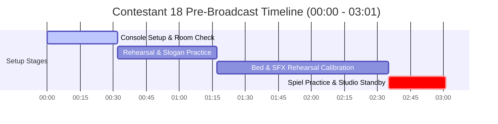

# Contestant 18 — Mic Check & Pre-Broadcast Analysis

## 📊 Mic Check Metadata

| Field | Value |
|---|---|
| **Audio File** | `NSPC-Samples/Contestant-18.mp3` |
| **Source Segment Data** | `scratch_transcripts/Contestant-18.json` |
| **Contestant ID** | Contestant 18 |
| **Mic Check Timestamp Range** | `00:00 - 02:35` (0.00s - 155.00s) |
| **Pre-Broadcast Standby Range** | `02:35 - 03:01` (155.00s - 181.64s) |
| **Total Pre-Broadcast Duration** | 03:01 (181.64 seconds) |
| **Medium / Language** | Filipino / Tagalog, Taglish |
| **Competition Event** | NSPC Radio Broadcasting & Scriptwriting (Filipino Medium) |
| **Station Callsign / ID** | DCJV 91.26 *(NSPC Patrol)* |

---

## 👥 Personnel & Production Cast

| Speaker / Role | Identified Name | Sound Check & Pre-Broadcast Function |
|---|---|---|
| **ANCHOR 1 (Lead Anchor)** | Gia Ruzano | Studio mic check, console voice level balancing, script rehearsal (*"Ito ang mga antabay sa bawat eksklusibong balita..."*, *"Ang inyong lingkod, Gia Ruzano"*) |
| **ANCHOR 2 (Co-Anchor)** | Ron Cenia *(Ron Sinia)* | Microphone channel test, headline teaser practice (*"Nakalalasong likido na natagpuan sa Spratly Islands..."*) |
| **TECHNICAL DIRECTOR** | Carl Amin | Audio board operator — sound effects calibration, music bed fader balancing, headphone monitor adjustments, audio track arming (*"Kauban sad nato sa technical side si Carl Amin, direk sa DCJV 91.26 NSPC Patrol!"*) |
| **SPORTSCASTER** | Mitko Javier | Sports microphone channel check, voice projection testing (*"ATP Challenger 50 Fujairah Open..."*) |
| **SHOWBIZ REPORTER** | Radeven Ichi Camorra | Entertainment microphone channel check, audio gain level testing |
| **INFOMERCIAL ENSEMBLE** | Drama / Voice Cast | Developmental infomercial sound balance and acoustic test |
| **FLOOR DIRECTOR / TIMER** | Studio Director / Timer | Studio room management, floor cues, countdown warnings to live broadcast |

---

## ⏱️ Pre-Broadcast Timeline Breakdown

| Phase | Timestamp Range | Duration | Technical Description |
|---|---|---|---|
| **Phase 1: Console Setup & Room Acoustic Check** | `00:00 - 00:32` | 00:32 (32.59s) | Audio console initialization, room noise calibration, microphone placement, talent seating |
| **Phase 2: Rehearsal & Slogan Sound Check** | `00:32 - 01:17` | 00:45 (44.03s) | Team spiels rehearsal, station slogans, technical director acknowledgment, Spratly Islands teaser |
| **Phase 3: Music Bed & SFX Rehearsal Calibration** | `01:17 - 02:35` | 01:18 (78.47s) | Music bed ducking calibration, sound effect/stinger test, console fader leveling, chant checks |
| **Phase 4: Spiel Practice & Pre-Broadcast Standby** | `02:35 - 03:01` | 00:26 (26.64s) | Final anchor spiel test (*"Ang inyong lingkod, Gia Ruzano"*, infomercial practice snippet), studio silence, technical track arming, countdown to live broadcast |

---

## 🎙️ Verbatim Mic Check & Setup Transcript

### 1. Initial Setup & Rehearsal Run-Through [00:00 - 01:17]

`[00:00 - 00:32]`  
*[AUDIO: AUDIO CONSOLE INITIALIZATION, AMBIENT ROOM TONE & MICROPHONE POSITIONING]*

`[00:32 - 00:40]`  
**ANCHOR 1 (Gia Ruzano - Practice):**  
Ito ang mga antabay sa bawat eksklusibong balita...  
*[Ito ang mga kabay sa bawat eksklusyong balita na mga balita.]*

`[00:40 - 00:47]`  
**ANCHOR / NEWSCASTER (Practice):**  
Nakalalasong likido na natagpuan sa Spratly Islands sa pakawala ng mga mangingisdang Tsino.  
*[Ang pagalasang dikilo na natagpuan sa Sparky Islands sa pakanaraw ng mga manginis ng Geno.]*

`[00:49 - 00:56]`  
**STATION ENSEMBLE (Practice):**  
Ito ang NSPC Patrol! Ito ang NSPC Patrol!  
*[Ito ang NSBC Patrol. Ito ang NSBC Patrol.]*

`[00:56 - 01:08]`  
**ANCHOR 1 (Gia Ruzano - Practice):**  
Kauban sad nato sa technical side si Carl Amin, direk sa DCJV 91.26 NSPC Patrol!  
*[Ito sa technical side si Carl Amin, diri sa BusyJV91.26 NSBC Patrol.]*

`[01:08 - 01:11]`  
**STATION ENSEMBLE (Practice):**  
Mabuhay ang magiting na peryodistang Pilipino!  
*[Maguhar ang manginis ng mga journalist ng Pilipino.]*

`[01:12 - 01:16]`  
**NEWSCASTER (Practice):**  
...Spratly Islands.  
*[Kung sa kutip, Sparky Islands.]*

---

### 2. Music Bed, SFX & Chant Calibration [01:17 - 02:35]

`[01:17 - 01:50]`  
*[AUDIO: MUSIC BED LEVEL TESTING, SFX PLAYBACK CALIBRATION & SOUNDBOARD GAIN BALANCING]*

`[01:50 - 02:35]`  
**TEAM ENSEMBLE (Chant Practice):**  
*[Vocal warmup / rhythmic chant check]*

---

### 3. Final Anchor Test & Pre-Broadcast Standby [02:35 - 03:01]

`[02:36 - 02:40]`  
**ANCHOR 1 (Gia Ruzano - Practice):**  
Ang inyong lingkod, Gia Ruzano.  
*[Ang inyong lingkod, di niya alusan.]*

`[02:41 - 02:51]`  
**INFOMERCIAL TALENT (Practice):**  
...ang bawat estudyante sa kani-kanilang paaralan...  
*[Ang bawat isyate sa kani, kanilang pahalaan...]*

`[02:51 - 02:55]`  
*[STUDIO SILENCE: TALENT IN POSITION, SCRIPTS READY, FLOOR DIRECTOR CUES]*

`[02:55 - 02:56]`  
*[STUDIO SILENCE: TECHNICAL DIRECTOR ARMS AUDIO TRACKS & CUES OPENING TAPE]*  
*(Acoustic silence marker: 175.25s - 176.46s)*

`[02:56 - 03:01]`  
*[STUDIO SILENCE: FINAL 5-SECOND COUNTDOWN & STANDBY BEFORE LIVE ON-AIR BROADCAST]*
