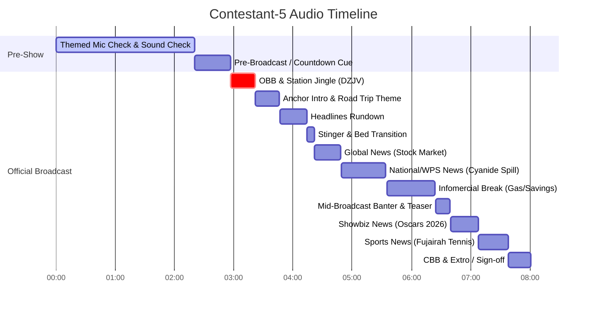

# Radio Broadcast Full Transcript — Contestant 5

## 📊 Broadcast & Recording Metadata

| Field | Value |
|---|---|
| **Audio File** | `NSPC-Samples/Contestant-5.mp3` |
| **Contestant ID** | Contestant-5 |
| **Competition Event** | NSPC Radio Broadcasting & Scriptwriting (Filipino Medium) |
| **Total Audio Duration** | 08:04 (484.37 seconds) \| Broadcast Speech Range: 02:57 - 08:01 (481.15s) |
| **Language** | Filipino / Tagalog, English (Taglish) |
| **Station ID / Call Sign** | DZJV 91.26 |
| **Program Title** | NSPC Patrol (DZJV 91.26 NSPC Patrol) |
| **Broadcast Setting / Theme** | Travel / Road Trip Concept (*"Travel Buddy sa Balita"*, *"Passenger Princess"*, *"Kabiyahero"*) |
| **Location Mentioned** | Ormoc City (*spoken in mic check as Arma City*) |
| **Broadcast Time Check** | Ala-dose ng tanghali / hapon (*"12 pa lang ng hapon pero nag-relapse ka na"*) |

---

## 👥 Production Team & Speakers

| Role / Tag | Name / Character | Notes |
|---|---|---|
| **ANCHOR 1** | Ralph Corton (*spoken verbatim as Ralph Bouton / Ralph Corton / Ronald Portoy*) | Main Male News Anchor (*"Travel Buddy sa Balita"*, Headlines, News tag, Infomercial Driver, Showbiz intro, Extro) |
| **ANCHOR 2** | Erika Flores (*spoken verbatim as Erica Flores / Elka Flores*) | Main Female News Anchor (*"Passenger Princess"*, *"Story Travel Mate"*, Headlines, News tag, Infomercial Passenger, Sports intro, Extro) |
| **NEWSCASTER 1** | Citi Aziz (*spoken verbatim as City / Citi Aziz*) | National & Global News Reporter (Middle East conflict & global stock market decline) |
| **NEWSCASTER 2** | Lorenz Pivite (*spoken verbatim as Lorenz / Lorenz Pivite*) | Environmental & West Philippine Sea Reporter (Cyanide chemical spill in Ayungin Shoal) |
| **SPORTSCASTER** | Yul Gonzales (*spoken verbatim as Yul / Yul Gonzales*) | Sports Reporter (Francis Casey Alcantara / Fujairah Open fire incident) |
| **SHOWBIZ REPORTER** | Kenneth (*spoken verbatim as Kenneth / Showbiz Patroller*) | Entertainment Reporter (Oscars Academy Awards 2026 / Michael B. Jordan) |
| **INFOMERCIAL ENSEMBLE** | Ralph, Erika, Citi, Lorenz, Kenneth, Yul | Road stop drama (Red light banter, budget struggles, and Department of Energy gas price advisory) |
| **TECHNICAL DIRECTOR / FLOOR DIRECTOR** | Production Crew | Mic check disclaimer announcer & pre-broadcast countdown caller (*"...na sa lima, apat, tatlo..."*) |

---

## ⏱️ Timeline & Section Breakdown

- **Section 1: MIC CHECK & TECHNICAL PREPARATION** `[00:00 - 02:20]` (0.00s - 140.29s)
- **Section 2: PRE-BROADCAST / TRANSITION** `[02:20 - 02:57]` (140.29s - 177.64s)
- **Section 3: ACTUAL RADIO BROADCAST** `[02:57 - 08:01]` (177.64s - 481.15s)

---

## 📜 Full Verbatim Transcript

### SECTION 1: MIC CHECK & THEMED SOUND CHECK [00:00 - 02:20]

`[00:03 - 00:08]` **TECHNICAL DIRECTOR / ANNOUNCER:** [DISCLAIMER / MIC CHECK START]  
Ang bahagi ito ay para lamang sa pagsubok ng mikropono at tunog na gagamit *[gagamitin]* lang.

`[00:09 - 00:18]` **ANCHOR 1 (Ralph Corton):** [ANCHOR 1 PRACTICE]  
Magandang hapon at luluzon *[sa Luzon]*, Visayas at Litanaw *[Mindanao]*.

`[00:18 - 00:22]` **ANCHOR 1 (Ralph Corton):**  
Ako ay yung *[ang inyong]* story-telling after one *[anchor one / partner one]*, Ralph Bouton *[Corton]*.

`[00:22 - 00:28]` **ANCHOR 1 (Ralph Corton):**  
Na uh, bukod sa haba ng biyahe, tulad *[tila]* naman naging masaya at makasaysayan ang ating karanasan.

`[00:29 - 00:33]` **ANCHOR 2 (Erika Flores):** [ANCHOR 2 PRACTICE]  
At naman naman *[ako naman]* ang inyong passenger princess, Erica Flores.

`[00:33 - 00:41]` **ANCHOR 2 (Erika Flores):**  
Tama ka dyan, Ralph, kaya patuloy pa rin ang ating paglalakbay, lalo na sa ating panibagong stopover, Arma *[Ormoc]* City.

`[00:41 - 00:46]` **ANCHOR 2 (Erika Flores):**  
Kaya naman, mga kabiyahero, kilalanin natin ang mga kasama nyo sa libut *[likod]* ng manibela.

`[00:46 - 00:50]` **ANCHOR 2 (Erika Flores):**  
At ano kaya ang kanilang tips and stories sa kalsada?

`[00:50 - 00:55]` **NEWSCASTER 1 (Citi Aziz):** [NEWSCASTER 1 PRACTICE - DRIVER TIP]  
Uunahan ko na, ha? Ako ang inyong maingat na driver, City *[Citi]*.

`[00:55 - 01:00]` **NEWSCASTER 1 (Citi Aziz):**  
Tip ko sa biyahe, okay lang mag-i-mode *[mag-emote]* sa inyong favorite road trip playlist.

`[01:00 - 01:02]` **NEWSCASTER 1 (Citi Aziz):**  
Pero wag over sa volume, ha?

`[01:03 - 01:06]` **NEWSCASTER 1 (Citi Aziz):**  
Baka ang malapit, ikulang atake *[dapat pampakalma]* mo ay maging delikado na yung takbo.

`[01:07 - 01:13]` **NEWSCASTER 2 (Lorenz Pivite):** [NEWSCASTER 2 PRACTICE - DRIVER TIP]  
Eh, yung main character yan *[yarn]*, at ako naman ang inyong chill at cool driver, Lorenz.

`[01:13 - 01:19]` **NEWSCASTER 2 (Lorenz Pivite):**  
Sa biyahe, huwag kalimutang bumusina, lalo na sa blind curves at intersections, para may heads up ang kasalubong.

`[01:19 - 01:22]` **NEWSCASTER 2 (Lorenz Pivite):**  
Hindi yung bigla na lang kayong magkikita.

`[01:22 - 01:23]` **ANCHOR 2 / TEAM:**  
Hopya!

`[01:23 - 01:24]` **NEWSCASTER 2 (Lorenz Pivite):**  
Papok dool! *[Papukdol!]*

`[01:26 - 01:31]` **SPORTSCASTER (Yul Gonzales):** [SPORTSCASTER PRACTICE - DRIVER TIP]  
At ako naman ang inyong fast and cautious driver, Yul.

`[01:31 - 01:32]` **SPORTSCASTER (Yul Gonzales):**  
Tip ko lang rin, ha?

`[01:32 - 01:34]` **SPORTSCASTER (Yul Gonzales):**  
Na-focus *[Mag-focus]* sa pagmamaneho.

`[01:34 - 01:39]` **SPORTSCASTER (Yul Gonzales):**  
Tingin sa kaliwa, tingin sa kanan, huwag sa taong hindi ka naman kayang palipitan *[panindigan]*.

`[01:39 - 01:40]` **TEAM BANTER:**  
Ay, kuwa *[kuya]*!

`[01:40 - 01:45]` **SHOWBIZ REPORTER (Kenneth):** [SHOWBIZ REPORTER PRACTICE - DRIVER TIP]  
Ito naman si Kuya, at ako naman ang inyong daily kalma na driver, Kenneth.

`[01:46 - 01:55]` **SHOWBIZ REPORTER (Kenneth):**  
Tip ko lang sa biyahe, iwasan ang pagkakarera at over-speeding, ugaling magig-cool *[maging cool]* at kalma, para sa kalsada, goodbye!

`[01:57 - 02:03]` **ANCHOR 1 (Ralph Corton):** [ANCHOR WRAP-UP]  
Oo na na, ito yan *[Oo naman, ito 'yun]*. Kaya naman laging tandaan, mga katehero *[kabiyahero]*, ang mga tips and stories na ipinahagi sa atin.

`[02:03 - 02:04]` **ANCHOR 2 (Erika Flores):**  
True ka dyan, Ralph.

`[02:04 - 02:06]` **ANCHOR 2 (Erika Flores):**  
Kaya kumapit ng bagay *[nang maayos]*.

`[02:06 - 02:12]` **ANCHOR 2 (Erika Flores):**  
Maayos, mga kabiyahero, dahil magbibiyahe na ang NSPC Patrol.

`[02:14 - 02:17]` **TEAM / CHORUS:** [PRACTICE JINGLE]  
Para sa bayan sa dika na *[sandigan ng]* mamamayan.

`[02:19 - 02:20]` **TEAM / CHORUS:**  
NSPC!

---

### SECTION 2: PRE-BROADCAST / TRANSITION [02:20 - 02:57]

`[02:20 - 02:53]` `[STUDIO SILENCE / TECHNICAL ADJUSTMENTS / PRE-BROADCAST STANDBY]`

`[02:53 - 02:57]` **TECHNICAL DIRECTOR / FLOOR DIRECTOR:** [PRE-BROADCAST COUNTDOWN CUE]  
Kalitaan *[Balitaan]* na sa lima, apal *[apat]*, tatlo...

---

### SECTION 3: ACTUAL RADIO BROADCAST [02:57 - 08:01]

#### 1. OPENING BILLBOARD (OBB), STATION JINGLE & STATION ID [02:57 - 03:22]

`[02:57 - 03:03]` `[INTRO MUSIC UP / STATION JINGLE IN]`  
**CHORUS / ENSEMBLE:** Para sa bayan, sa dika na *[sandigan ng]* mamamayan!

`[03:05 - 03:11]` **CHORUS / ENSEMBLE:** NSPC, kabalitaan, boses nyo'y makikingar *[mapapakinggan]*. Ito'y inyong sandigan!

`[03:12 - 03:18]` `[MUSIC SWELLS]`  
**STATION ID VOICEOVER / ANNOUNCER:** Sa kain na, kay Mubiani na *[Saan ka man, saan magpunta]*, ang DZJV 91.26, NSPC Patrol!

`[03:22 - 03:22]` `[SFX: CAR HORN / BEEP BEEP]`  
**AUDIO EFFECT:** Pipip!

---

#### 2. FORMAL ANCHOR GREETINGS & THEMATIC INTRO [03:23 - 03:46]

`[03:23 - 03:28]` `[NEWS THEME BED STARTS — UP AND UNDER]`  
**ANCHOR 1 (Ralph Corton):** Isang mainin *[mainit]* na araw, Pilipinas. Ako ang inyong travel buddy sa Balita, Ralph Corton.

`[03:28 - 03:32]` **ANCHOR 2 (Erika Flores):** At ako naman ang inyong story travel mate, Erica Flores.

`[03:32 - 03:35]` **ANCHOR 2 (Erika Flores):** Oo, Ralph, handa ka na ba sa biyahe natin ngayon?

`[03:35 - 03:37]` **ANCHOR 1 (Ralph Corton):** Oo naman, laging handa.

`[03:37 - 03:38]` **ANCHOR 1 (Ralph Corton):** Lalo na kung kaibigan *[kabiyahero]*.

`[03:38 - 03:40]` **ANCHOR 2 (Erika Flores):** Ang dala namin ay mga kwento, makatotohanan.

`[03:40 - 03:45]` **ANCHOR 1 (Ralph Corton):** Kaya naman mga kabiyahero, narito na ang mga trending news ngayon.

---

#### 3. HEADLINES RUNDOWN [03:47 - 04:13]

`[03:47 - 03:51]` `[SFX: HEADLINE STINGER]`  
**ANCHOR 1 (Ralph Corton):** Una sa ating ruta, global stock market pinakangang bahagpumapapa *[pinangangambahang bumaba / bumagsak]*.

`[03:52 - 03:57]` `[SFX: HEADLINE STINGER]`  
**ANCHOR 2 (Erika Flores):** At kaso ng pagbubuhos na *[ng]* nakalilasong *[nakalalasong]* chemical cyanide na hidala sa ailing show *[naitala sa Ayungin Shoal]*.

`[03:58 - 04:03]` `[SFX: HEADLINE STINGER]`  
**ANCHOR 1 (Ralph Corton):** Para sa showbiz sika *[chika]*, sino-sinong artist at anong mga pelikula kaya ang waging *[wagi]* sa Oscars 2026?

`[04:04 - 04:04]` **ANCHOR 2 (Erika Flores):** Ati *[Ating]* alamin!

`[04:05 - 04:10]` `[SFX: HEADLINE STINGER]`  
**ANCHOR 1 (Ralph Corton):** At para sa biyaheng sports, ano kaya ang kalagayan ng isang Pilipino tennis player...

`[04:10 - 04:13]` **ANCHOR 1 (Ralph Corton):** ...matapos magkaroon ng sunog sa Buhayra *[Fujairah]* Open?

`[04:14 - 04:22]` `[MUSIC TRANSITION / NEWS BUMPER BED PLAYS]`

---

#### 4. GLOBAL / NATIONAL NEWS: STOCK MARKET DECLINE [04:22 - 04:48]

`[04:22 - 04:29]` `[NEWS REPORT BED CONTINUES UNDER]`  
**NEWSCASTER 1 (Citi Aziz):** Nagpapatuloy na bumababa ang global stock market matapos ang pagtuloy *[patuloy]* na hituwaan *[hidwaan]* sa Middle East.

`[04:29 - 04:36]` **NEWSCASTER 1 (Citi Aziz):** Dulot nito nabahala naman ang mga tao sa posibleng overinflation, housing affordability at economic stability.

`[04:37 - 04:40]` **NEWSCASTER 1 (Citi Aziz):** Nakapagtalari *[Nakapagtala rin]* ng pagbaba sa European and Asian markets.

`[04:40 - 04:45]` **NEWSCASTER 1 (Citi Aziz):** Na maaaring maka-apekto sa ekonomiya ng iba't ibang bansa.

`[04:46 - 04:48]` `[SFX: STINGER]`  
**NEWSCASTER 1 (Citi Aziz):** Citi Aziz at *[NSPC]* Patrol.

---

#### 5. WEST PHILIPPINE SEA / ENVIRONMENTAL NEWS: AYUNGIN SHOAL CYANIDE SPILL [04:49 - 05:34]

`[04:49 - 04:53]` `[NEWS BED IN]`  
**ANCHOR 1 (Ralph Corton):** O sa mga mangingis na *[mangingisda]* natin dyan bandaw ayung insyoul *[bandang Ayungin Shoal]*.

`[04:53 - 05:00]` **ANCHOR 2 (Erika Flores):** Maghihigat *[Mag-ingat]* kayo sapagkat may naitalang kaso ng chemical spill na nagdulot ng pagkalason sa mga lamang dagat *[yamang-dagat]*.

`[05:00 - 05:04]` **ANCHOR 1 (Ralph Corton):** Para sa buong kuwanto *[kuwento]*, narito si Lorenz Pivite.

`[05:05 - 05:07]` `[REPORTER BED IN]`  
**NEWSCASTER 2 (Lorenz Pivite):** Nagdulot ng pangalim *[pangamba]* sa marine ecosystem.

`[05:07 - 05:10]` **NEWSCASTER 2 (Lorenz Pivite):** Matapos ang naitalang kaso ng pagbubuhos na *[ng]* nakalilasong *[nakalalasong]* chemical cyanide.

`[05:10 - 05:13]` **NEWSCASTER 2 (Lorenz Pivite):** Sa paligid ng ayung insyoul *[Ayungin Shoal]*.

`[05:13 - 05:18]` **NEWSCASTER 2 (Lorenz Pivite):** Kung saan, pumapatay sa mga lamang dagat *[yamang-dagat]* at itinuturing ito na isang sabotaje *[sabotahe]* galing sa China.

`[05:19 - 05:25]` **NEWSCASTER 2 (Lorenz Pivite):** Kapag *[Dahil]* nito, pinaiting *[pinaigting]* ng Armed Forces of the Philippines, maging ng Philippine Coast Guard ang pagbabatay *[pagbabantay]* sa naturang lugar.

`[05:25 - 05:31]` **NEWSCASTER 2 (Lorenz Pivite):** Upang paiwasan *[maiwasan]* ang karagdagang pinsalan *[pinsala]* sa kalikasan at hindi na maulit ang katulad ng *[na]* insidente.

`[05:32 - 05:34]` `[SFX: STINGER]`  
**NEWSCASTER 2 (Lorenz Pivite):** Lorenz Pivite and *[NSPC]* Patrol.

---

#### 6. INFOMERCIAL / COMMERCIAL BREAK: FINANCIAL LITERACY & GAS PRICE HIKE [05:35 - 06:24]

`[05:35 - 05:39]` `[SFX: TRAFFIC SOUNDS / CAR HORN / COMMERCIAL BED IN]`  
**ANCHOR 1 / DRIVER (Ralph):** O sa mga kabihayero *[kabiyahero]*, red light muna. Wala mo nang *[munang]* bababa ha?

`[05:40 - 05:40]` **PASSENGER 1:**  
Oo.

`[05:40 - 05:41]` **PASSENGER 2:**  
Uy! Mga motor *[tingnan mo]*!

`[05:42 - 05:44]` **PASSENGER 1:**  
Bagong news *[sapatos]*! Bagong cellphone!

`[05:46 - 05:47]` **PASSENGER 2:**  
Tingin mo riyan!

`[05:48 - 05:51]` **PASSENGER 3:**  
Hala! Wato *[Totoo]* ba ang taas na *[ng]* presya ng nangis *[langis]*?

`[05:51 - 05:52]` **PASSENGER 1:**  
Mas mahalagahin *[mahalaga 'yun]*!

`[05:53 - 05:56]` **PASSENGER 3:**  
Wala na akong pera! Anong gagawin ko?

`[05:58 - 06:01]` `[SFX: DRAMATIC CHORD]`  
**VOICE 1:** Napipisig nating *[Napipilitan tayong]* ingatan ang ating pera.

`[06:02 - 06:05]` **VOICE 2:** Alamin-surihin *[Alamin, suriin]* natin ang tabang *[tamang]* paraan.

`[06:05 - 06:07]` **VOICE 3:** Halina! Oo!

`[06:07 - 06:09]` **VOICE 4:** Huwag na busuhin *[nang ubusin]*!

`[06:09 - 06:12]` **ENSEMBLE (ALL):** Simulan na ang pagtitipin *[pagtitipid]*!

`[06:13 - 06:14]` `[SFX: TRANSITION STINGER]`  
**ANNOUNCER:** O yun! Sunset! Sunset! *[SFX: Stinger]*

`[06:14 - 06:19]` `[PSA BED PLAYS UNDER]`  
**PSA NARRATOR:** At sa saabong *[Ayon sa pinakahuling]* report ng Department of Energy, umabot na sa 90 pluses mataas *[pesos pataas]* ang presyo ng langis.

`[06:19 - 06:21]` **PSA NARRATOR:** Magitiip *[Magtipid]* at magkaroon ng kalaman *[kaalaman]*.

`[06:22 - 06:24]` `[SFX: BUMPER ACCENT]`  
**PSA NARRATOR / STATION TAG:** Ang susampalang *[paalalang]* ito ay aking *[hatid]* sa inyo na may pilang *[ng himpilang]* ito.

---

#### 7. MID-BROADCAST RETURN & SHOWBIZ TEASER [06:25 - 06:39]

`[06:25 - 06:32]` `[UPBEAT PROGRAM BED IN]`  
**ANCHOR 1 (Ralph Corton):** 12 pa lang ng hapon pero nag-relapse ka na.

`[06:32 - 06:33]` **ANCHOR 1 (Ralph Corton):** Kaya pa ba Erika?

`[06:33 - 06:35]` **ANCHOR 2 (Erika Flores):** Oo naman! Kaya!

`[06:36 - 06:39]` `[SFX: STINGER]`  
**ANCHOR 1 (Ralph Corton):** At para sa showbiz chika Kenneth?

---

#### 8. SHOWBIZ NEWS: OSCARS ACADEMY AWARDS 2026 [06:40 - 07:08]

`[06:40 - 06:45]` `[SHOWBIZ BED STARTS — UP AND UNDER]`  
**SHOWBIZ REPORTER (Kenneth):** Kumilang *[Kumislap]* na nga ang ilang films at artists sa Oscars Academy Awards 2026...

`[06:45 - 06:47]` **SHOWBIZ REPORTER (Kenneth):** ...kabila *[kabilang]* na si Michael B. Jordan...

`[06:47 - 06:52]` **SHOWBIZ REPORTER (Kenneth):** ...na nagpakita ng husay sa pag-arte at pinarangalan bilang best actor.

`[06:52 - 06:56]` **SHOWBIZ REPORTER (Kenneth):** Hindi rin nagpatalo ang mga weak film *[big films]* kagay na laman ng practice time *[kagaya na lamang ng Practice Time]*...

`[06:56 - 07:00]` **SHOWBIZ REPORTER (Kenneth):** ...na nangibabaw sa technical and creative categories...

`[07:00 - 07:05]` **SHOWBIZ REPORTER (Kenneth):** ...maging ang singers *[Sinners]* at One Battle After Another na humakot ng major awards.

`[07:05 - 07:08]` `[SFX: STINGER]`  
**SHOWBIZ REPORTER (Kenneth):** Showbiz but shoulder, can't believe it *[Showbiz Patroller, Kenneth]*!

---

#### 9. SPORTS NEWS: FRANCIS CASEY ALCANTARA / FUJAIRAH OPEN FIRE [07:08 - 07:38]

`[07:08 - 07:11]` `[SPORTS BED IN]`  
**ANCHOR 2 (Erika Flores):** Para sa sports timeout, Yul Gonzales iras sa damo *[ilarga ang bola / hataw sa damo]*.

`[07:12 - 07:16]` `[SPORTS BED CONTINUES UNDER]`  
**SPORTSCASTER (Yul Gonzales):** Kasalubuyang na tenga *[Kasalukuyang natengga]* si Filipino tennis star Francis Casey Alcantara...

`[07:16 - 07:21]` **SPORTSCASTER (Yul Gonzales):** ...matapos kansalangin *[kanselahin]* ang Challenger 50 Fuhaira *[Fujairah]* Open sa United Arab Emirates...

`[07:21 - 07:25]` **SPORTSCASTER (Yul Gonzales):** ...ng makroon *[nang magkaroon]* ng sunog dahil sa drone debris na nangulog *[nahulog]* sa isang golf facility.

`[07:25 - 07:30]` **SPORTSCASTER (Yul Gonzales):** Humingi na ng tulog *[tulong]* si Alcantara sa Philippine Sports Commission at sa kanyang mga taga-suporta.

`[07:30 - 07:35]` **SPORTSCASTER (Yul Gonzales):** Binigay *[Tiniyak]* din naman ng PSC ang kaligtasan ng mga atleta sa nasabing trahedya.

`[07:35 - 07:38]` `[SFX: STINGER]`  
**SPORTSCASTER (Yul Gonzales):** Sports Patroller, Yul Gonzales.

---

#### 10. CLOSING BILLBOARD (CBB), EXTRO & SIGN-OFF [07:42 - 08:01]

`[07:42 - 07:45]` `[CLOSING STATION BED UP AND UNDER]`  
**ANCHOR 1 (Ralph Corton):** Naguna *[Nakarating na]* ang ating biyahe sa araw na ito.

`[07:45 - 07:49]` **ANCHOR 1 (Ralph Corton):** Sa muni kami *[Muli, kami]* ang iyong travel partner sa Balita, Ronald Portoy *[Ralph Corton]*...

`[07:49 - 07:51]` **ANCHOR 2 (Erika Flores):** ...At Elka *[Erika]* Flores.

`[07:51 - 07:56]` **ANCHOR 1 (Ralph Corton):** Sa itinaas na National State of Emergency sa bansa, dapat siyindi *[ay hindi]* bumaba ang ating pag-asa.

`[07:56 - 08:01]` **ANCHOR 2 (Erika Flores):** Dahil sa nabal ng daan-daan super, kasama ang milyong-milyong konyote *[Dahil sa bawat daan na tatahakin, kasama ang milyun-milyong kabiyahero]*.

`[08:01 - 08:01]` `[OUTRO JINGLE / MUSIC FADES OUT]`
