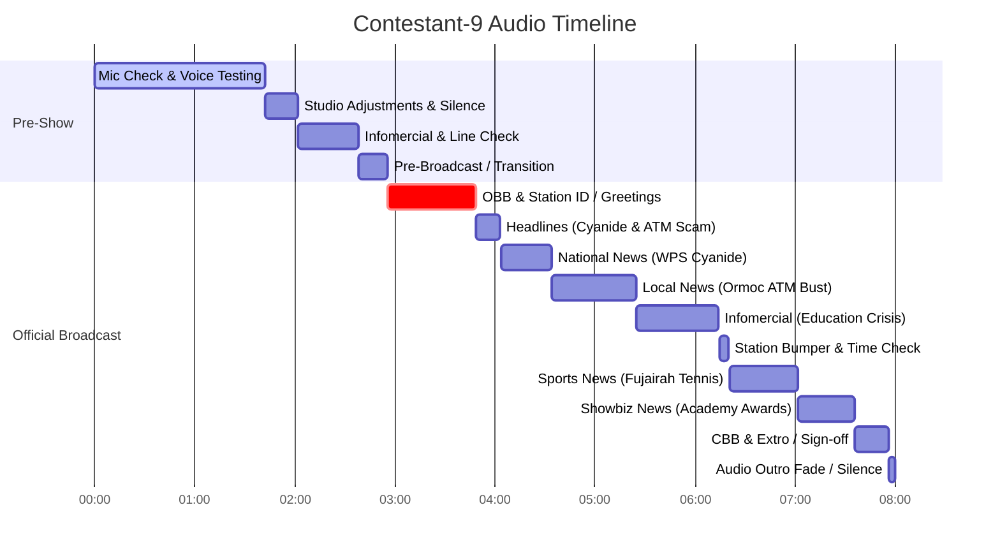

# Radio Broadcast Full Transcript — Contestant 9

## 📊 Broadcast & Recording Metadata

| Field | Value |
|---|---|
| **Audio File** | `NSPC-Samples/Contestant-9.mp3` |
| **Contestant ID** | Contestant-9 |
| **Competition Event** | NSPC Radio Broadcasting & Scriptwriting (Filipino Medium) |
| **Total Audio Duration** | 08:00 (480.93 seconds) |
| **Language** | Filipino / Tagalog, English, Bisaya/Cebuano greeting (Taglish) |
| **Station ID / Call Sign** | DYJV 91.26 KHz (*spoken verbatim as siluang PCJV / PCJV / 91 26 sa easy na wang*) |
| **Program Title** | NSPC Patrol (*Radyo NSPC / NSPC Patrol*) |
| **Broadcast Time Check** | 56 ng hapon (*spoken verbatim as RSLS 56 ng hapon*, 1:56 PM) |
| **Broadcast Date** | Miyerkules, Abril 16, 2026 (*spoken verbatim as Inay, Merkulay, April 16, 2026*) |
| **Broadcast Origin / Location** | Ormoc City, Leyte (*spoken verbatim as Tahanan ng mga pinis / Maayong Adlao or Moc City*) |

---

## 👥 Production Team & Speakers

| Role / Tag | Name / Character | Notes & Assigned Content |
|---|---|---|
| **ANCHOR 1** | Sebastian Salva | Main Anchor (Opening, Station Intro, Date Check, National Headlines & News on WPS Cyanide, Sports Intro, Closing Extro / Sign-off) |
| **ANCHOR 2** | Samira Abdaman (*spoken verbatim as Samira Abdaman / sa Mira Abacan*) | Co-Anchor (Opening, Station Intro, Bisaya Greeting, Local Crime Headlines & Intro, Showbiz Intro, Closing Extro / Sign-off) |
| **NEWSCASTER 1** | Jamaica Madanan (*spoken verbatim as Jamay kamaranan / siya may kambaranan / siyang may kamarana*) | Field / Local Crime Reporter (Live report from Ormoc City on 29-year-old ATM / financial scammer arrest) |
| **SPORTSCASTER** | Sunny Cedillo (*spoken verbatim as Sonny Celio / Sunny Cedillo*) | Sports Reporter (ATP Challenger 50 Fujairah Open tennis cancellation & Francis Alcantara) |
| **SHOWBIZ REPORTER** | Sam Bernardino (*spoken verbatim as Sam Bergino / Sam Bernardino*) | Entertainment Reporter (98th Academy Awards 2026, Michael B. Jordan Best Actor, Sinners) |
| **INFOMERCIAL - TOTO** | Uncredited (Student voice) | PSA Character (Overcrowded classroom struggling student) |
| **INFOMERCIAL - NENE** | Uncredited (Student voice) | PSA Character (Fast lesson pacing, aspiring engineer student) |
| **INFOMERCIAL - MICA** | Uncredited (Student voice) | PSA Character (Shortage of school materials, book lover student) |
| **INFOMERCIAL - PSA NARRATOR** | Uncredited (Advocacy Voiceover) | PSA Voiceover (Education crisis advocacy: *"Tukasyon ay tutukan... Boses mo ang instrumento"*) |
| **TECHNICAL DIRECTOR / VO** | Uncredited (Audio Controller / Station VO) | Cue caller, countdown director, station liners (*"Umeere, 91.26... PCJV, NSPC Patrol"*) |

---

## ⏱️ Timeline & Section Breakdown

- **Section 1: MIC CHECK & TECHNICAL PREPARATION** `[00:00 - 02:38]` (158 seconds)
- **Section 2: PRE-BROADCAST / TRANSITION** `[02:38 - 02:56]` (18 seconds)
- **Section 3: ACTUAL RADIO BROADCAST** `[02:56 - 07:56]` (300 seconds / 5:00)
- **Section 4: AUDIO OUTRO FADE / SILENCE** `[07:56 - 08:00]` (4 seconds)

---

## 📜 Full Verbatim Transcript

### SECTION 1: MIC CHECK & TECHNICAL PREPARATION [00:00 - 02:38]

`[00:00 - 00:05]` [MIC TEST - ANCHOR 1]  
**ANCHOR 1 (Sebastian Salva):** Ito ay Pagsubok sa Pagsasahing Papawid News, Anger 1.

`[00:06 - 00:10]` [MIC TEST - ANCHOR 2]  
**ANCHOR 2 (Samira Abdaman):** Ito ay Pagsubok sa Pagsasahing Papawid News, Anger 2.

`[00:10 - 00:14]` [MIC TEST - PRESENTER 1]  
**NEWSCASTER 1 (Jamaica Madanan):** Ito ay Pagsubok sa Pagsasahing Papawid News, Pre-Center 1.

`[00:15 - 00:19]` [MIC TEST - PRESENTER 2]  
**SPORTSCASTER (Sunny Cedillo):** Ito ay Pagsubok sa Pagsasahing Papawid News, Pre-Center 2.

`[00:19 - 00:24]` [MIC TEST - PRESENTER 3]  
**SHOWBIZ REPORTER (Sam Bernardino):** Ito ay Pagsubok sa Pagsasahing Papawid News, Pre-Center 3.

`[00:24 - 00:26]` [STATION ID TEST]  
**TECHNICAL DIRECTOR / TEAM:** Ito ang NSBC Patrol.

`[00:26 - 00:28]` [STATION ID TEST]  
**TECHNICAL DIRECTOR / TEAM:** Ito ang NSBC Patrol.

`[00:28 - 00:33]` [SLOGAN & ROLL CALL]  
**ANCHOR 1 (Sebastian Salva):** Handa na pong magbalita ang boss si Sebastian Salva.

`[00:33 - 00:36]` [SLOGAN & ROLL CALL]  
**ANCHOR 2 (Samira Abdaman):** Boses ng bayan sa Mira Abacan.

`[PAUSE / STUDIO ADJUSTMENT]`

`[00:39 - 00:43]` [SLOGAN & ROLL CALL]  
**NEWSCASTER 1 (Jamaica Madanan):** Nakaronda sa katotohanan siya may kambaranan.

`[00:44 - 00:48]` [SLOGAN & ROLL CALL]  
**SPORTSCASTER (Sunny Cedillo):** Sonny Celio, nakaronda sa Sports Updates.

`[00:49 - 00:52]` [SLOGAN & ROLL CALL]  
**SHOWBIZ REPORTER (Sam Bernardino):** Nakaronda sa Chika Hang of the Go, Sam Bergino.

`[PAUSE / STUDIO ADJUSTMENT]`

`[00:56 - 00:58]` [STATION ID TEST]  
**TECHNICAL DIRECTOR / TEAM:** Ito ang NSBC Patrol.

`[00:58 - 01:00]` [STATION ID TEST]  
**TECHNICAL DIRECTOR / TEAM:** Ito ang NSBC Patrol.

`[01:00 - 01:09]` [PRACTICE CUE]  
**TECHNICAL DIRECTOR / ANCHOR 1:** Okay guys, Sonny, handa na, 1, 2, 3.

`[01:09 - 01:11]` [PRACTICE SLOGAN]  
**TEAM:** Handa ng rumong da.

`[01:11 - 01:12]` [PRACTICE CUE]  
**ANCHOR 1 / TEAM:** Ano tara?

`[01:12 - 01:14]` [PRACTICE COUNTDOWN]  
**TECHNICAL DIRECTOR / LEADER:** Dito sa 1, 2, 3.

`[01:15 - 01:18]` [PRACTICE SLOGAN]  
**TEAM:** Dito sa NSBC Patrol, kasama ka.

`[01:18 - 01:20]` [PRACTICE COUNTDOWN]  
**TECHNICAL DIRECTOR / LEADER:** Ang first, maayong 1, 2, 3.

`[01:21 - 01:23]` [PRACTICE BISAYA GREETING]  
**TEAM / ANCHORS:** Maayong Adlao or Moc City?

`[01:23 - 01:24]` [PRACTICE COUNTDOWN]  
**TECHNICAL DIRECTOR / LEADER:** Isa pa, 1, 2, 3.

`[01:25 - 01:27]` [PRACTICE BISAYA GREETING]  
**TEAM / ANCHORS:** Maayong Adlao or Moc City?

`[01:27 - 01:29]` [PRACTICE COUNTDOWN]  
**TECHNICAL DIRECTOR / LEADER:** Umeere, 1, 2, 3.

`[01:29 - 01:34]` [PRACTICE STATION ID]  
**TEAM / STATION VO:** Umeere, 91, 26, siluang PCJV, NSBC Patrol.

`[01:35 - 01:35]` [PRACTICE COUNTDOWN]  
**TECHNICAL DIRECTOR / LEADER:** Isa pa, 1, 2, 3.

`[01:35 - 01:35]` [PRACTICE COUNTDOWN]  
**TECHNICAL DIRECTOR / LEADER:** Isa pa, 1, 2, 3.

`[01:35 - 01:37]` [PRACTICE COUNTDOWN]  
**TECHNICAL DIRECTOR / LEADER:** Umeere, 1, 2, 3.

`[01:37 - 01:42]` [PRACTICE STATION ID]  
**TEAM / STATION VO:** Umeere, 91, 26, siluang PCJV, NSBC Patrol.

`[PAUSE / STUDIO ADJUSTMENT]`

`[02:02 - 02:05]` [INFOMERCIAL LINE TEST]  
**INFOMERCIAL TALENT 1 (Toto):** Ako si Toto, masipag ako sa klase.

`[02:05 - 02:18]` [INFOMERCIAL LINE TEST & CHAT]  
**INFOMERCIAL TALENTS (Nene & Mica):** Ako si Nene, ako si Mika, pero para saan pang mga po ay live?

`[PAUSE / STUDIO ADJUSTMENT]`

`[02:20 - 02:21]` [REPORTER TAG TEST]  
**NEWSCASTER 1 (Jamaica Madanan):** Sebastian Binalaan.

`[PAUSE / STUDIO ADJUSTMENT]`

`[02:23 - 02:25]` [SPORTS HEADLINE TEST]  
**SPORTSCASTER (Sunny Cedillo):** ATP Challenger 50 for Hira, open.

`[PAUSE / STUDIO ADJUSTMENT]`

`[02:27 - 02:30]` [FINAL SOUND CHECK]  
**TECHNICAL DIRECTOR / TEAM:** Sound check, 1, 2, 3. Sound, sound check.

`[02:31 - 02:36]` [MIC LEVEL CHECK]  
**TECHNICAL DIRECTOR / TEAM:** My test.

`[02:36 - 02:38]` [PRACTICE INTRO]  
**TEAM / STATION VO:** Naratsyara na ang Radyo NSBC.

---

### SECTION 2: PRE-BROADCAST / TRANSITION [02:38 - 02:56]

`[02:38 - 02:55]` [COUNTDOWN CUE]  
**TECHNICAL DIRECTOR / TEAM:** Naratsyara na ang NSBC Patrol, 5, 4.

`[02:55 - 02:56]` `[STUDIO SILENCE / FINAL STANDBY / INTRO MUSIC BED FADES IN]`

---

### SECTION 3: ACTUAL RADIO BROADCAST [02:56 - 07:56]

#### 1. OPENING BILLBOARD (OBB), STATION ID & GREETINGS [02:56 - 03:49]

`[02:56 - 03:04]` [OBB / INTRO MUSIC UP]  
**ANCHOR 1 / CHORUS:** At ito balit ang real, real, real.

`[03:04 - 03:05]` **ANCHOR 2 / CHORUS:** Ang papanahon.

`[03:05 - 03:07]` **CHORUS / ANCHOR 1:** Ang maaasahan.

`[03:07 - 03:10]` **CHORUS / ALL:** Dito sa NSBC Patrol, kasama ka.

`[03:11 - 03:13]` [CHORAL JINGLE CONTINUES]  
**CHORUS:** Kasama ka sa balitan.

`[03:14 - 03:15]` **CHORUS:** Pati na ang books.

`[03:15 - 03:18]` **CHORUS:** Sa mga handa ng rumanda.

`[03:18 - 03:19]` **CHORUS:** Handa ng rumanda.

`[03:19 - 03:22]` **CHORUS:** Pag-asa.

`[03:23 - 03:24]` [NEWS BED IN]  
**ANCHOR 1 (Sebastian Salva):** Tayo po ay live.

`[03:24 - 03:25]` **ANCHOR 2 (Samira Abdaman):** Mula.

`[03:25 - 03:26]` **ANCHOR 1 (Sebastian Salva):** Tahanan ng mga pinis.

`[03:28 - 03:29]` **ANCHOR 2 (Samira Abdaman):** Nangitin pila.

`[03:29 - 03:30]` **ANCHOR 1 (Sebastian Salva):** Ang tibay ng panahon.

`[03:30 - 03:32]` **ANCHOR 2 (Samira Abdaman):** Maayong naglaw or mob city.

`[03:33 - 03:36]` **ANCHOR 1 (Sebastian Salva):** Inay, Merkulay, April 16, 2026.

`[03:36 - 03:38]` **ANCHOR 1 (Sebastian Salva):** Ako po si Sebastian Salva.

`[03:39 - 03:41]` **ANCHOR 2 (Samira Abdaman):** Ako po naman si Samira Abdaman.

`[03:41 - 03:43]` **STATION VO / ANCHOR 1:** Mayroon, 91, 20, sa easy na wang.

`[03:44 - 03:46]` [STATION ID JINGLE ACCENT]  
**STATION VO / ALL:** PCJV, NSBC Patrol.

`[03:46 - 03:49]` [HEADLINES BED IN]  
**ANCHOR 1 (Sebastian Salva):** Narito na ang mga balitang tampok sa oras na ito.

---

#### 2. HEADLINE TEASERS [03:49 - 04:03]

`[03:49 - 03:51]` [SFX: HEADLINE STINGER]  
**ANCHOR 1 (Sebastian Salva):** Naku-pipener ito.

`[03:51 - 03:52]` **ANCHOR 1 (Sebastian Salva):** Chinese fishing vessels.

`[03:52 - 03:57]` **ANCHOR 1 (Sebastian Salva):** Napagalamang nagtatapo ng cyanide sa Spratly Islands, West Philippine Sea.

`[03:57 - 03:58]` [SFX: HEADLINE STINGER]  
**ANCHOR 2 (Samira Abdaman):** At BNP.

`[03:59 - 04:03]` **ANCHOR 2 (Samira Abdaman):** Pag-iingat ang publiko sa iligal na pagbebenta ng ATM cards at financial accounts.

---

#### 3. NATIONAL NEWS: WEST PHILIPPINE SEA CYANIDE SABOTAGE [04:04 - 04:34]

`[04:04 - 04:07]` [NEWS BED STARTS]  
**ANCHOR 1 (Sebastian Salva):** Partner, muli na namang pumipig sa kalaang cyanide.

`[04:07 - 04:13]` **ANCHOR 1 (Sebastian Salva):** Isang nakakalasong dynamikal na kumpiska mula sa Chinese boats sa West Philippine Sea.

`[04:13 - 04:15]` **ANCHOR 1 (Sebastian Salva):** Partikulang nasa Spratly Islands.

`[04:15 - 04:17]` **ANCHOR 1 (Sebastian Salva):** Ayon sa National Security Council,

`[04:17 - 04:22]` **ANCHOR 1 (Sebastian Salva):** nag-positibo sa cyanide ang naturang lugar na nagdala ng panganib sa kalusugan ng mga sundalo

`[04:22 - 04:25]` **ANCHOR 1 (Sebastian Salva):** dahil sa kontaminadong tubig at pagkain.

`[04:25 - 04:28]` **ANCHOR 1 (Sebastian Salva):** Bunso dito, patuloy na pinahihipitan ng NSC

`[04:28 - 04:29]` **ANCHOR 1 (Sebastian Salva):** ang papamasi.

`[04:29 - 04:34]` **ANCHOR 1 (Sebastian Salva):** Ang Philippine Coast Guard sa WPS upang maiwasan ang pagkasira ng kalikasan.

---

#### 4. LOCAL NEWS: ORMOC CITY CYBERCRIME ATM FRAUD ENTRAPMENT [04:34 - 05:25]

`[04:34 - 04:38]` [TRANSITION STINGER]  
**ANCHOR 2 (Samira Abdaman):** Maging mapanuri, yan ang pahalala ng BNP sa gitna ng mga kasong iligal

`[04:38 - 04:41]` **ANCHOR 2 (Samira Abdaman):** na pagbebenta ng ATM cards at financial accounts.

`[04:42 - 04:44]` **ANCHOR 2 (Samira Abdaman):** Jamay kamaranan, anong balita rito?

`[04:44 - 04:47]` [FIELD REPORT BED IN]  
**NEWSCASTER 1 (Jamaica Madanan):** Sebastian Binalaan, na otridadang bubiko,

`[04:47 - 04:52]` **NEWSCASTER 1 (Jamaica Madanan):** na iwasan ang iligal na pagbebenta ng ATM cards at financial accounts

`[04:52 - 04:54]` **NEWSCASTER 1 (Jamaica Madanan):** na naganap sa Ormoc City, Leyte.

`[04:54 - 04:58]` **NEWSCASTER 1 (Jamaica Madanan):** Sa kon dito, ang 29-anis na lalak na nahunin ng pulisya

`[04:58 - 04:59]` **NEWSCASTER 1 (Jamaica Madanan):** sa pamamagitan.

`[04:59 - 05:00]` **NEWSCASTER 1 (Jamaica Madanan):** Nang isang entrapment operation

`[05:01 - 05:05]` **NEWSCASTER 1 (Jamaica Madanan):** nakahalap sa kasong paglabag sa Anti-Financial Account Scamming Act

`[05:05 - 05:07]` **NEWSCASTER 1 (Jamaica Madanan):** at Cybercrime Prevention Act of 2012.

`[05:08 - 05:11]` **NEWSCASTER 1 (Jamaica Madanan):** Mga kapatrol, paalala naman ang Philippine National Police

`[05:11 - 05:15]` **NEWSCASTER 1 (Jamaica Madanan):** agad na i-report sa kinauukulan ang sino bang gagawa nito

`[05:15 - 05:19]` **NEWSCASTER 1 (Jamaica Madanan):** na karonda sa katotohanan siyang may kamarana.

`[05:19 - 05:21]` [STUDIO BUMPER / TEASER BED]  
**ANCHOR 1 (Sebastian Salva):** Mga kapatrol, wala tihim na karonda.

`[05:21 - 05:25]` **ANCHOR 2 (Samira Abdaman):** May sports at tsikahan pa tayo pagkatapos ng isang paalala.

---

#### 5. INFOMERCIAL / PSA: KRISIS SA EDUKASYON (EDUCATION CRISIS) [05:25 - 06:14]

`[05:25 - 05:28]` [INFOMERCIAL DRAMA BED IN]  
**INFOMERCIAL - TOTO:** Ako si Toto, masipag ako sa klase.

`[05:28 - 05:32]` **INFOMERCIAL - TOTO:** Pero sa sobrang sikit namin sa silid, hindi ako makapokus sa aming aralin.

`[05:33 - 05:35]` **INFOMERCIAL - NENE:** Ako si Nene, pangarap kong maging engineer.

`[05:35 - 05:39]` **INFOMERCIAL - NENE:** Kaso lang, sa sobrang bilis ng mga lesson, hindi ako nakakasubol.

`[05:40 - 05:42]` **INFOMERCIAL - MICA:** Ako si Mica, mahilig akong magbasa.

`[05:42 - 05:46]` **INFOMERCIAL - MICA:** Paso lang, kulang-kulang mga gamitan namin sa paaralan.

`[05:46 - 05:51]` **INFOMERCIAL - TOTO / NENE / MICA (ALL):** Kung ipagasan pa ang aming mga hinain, kumanan natin itong pulong sa hangin.

`[05:53 - 05:59]` [SFX: DRUM HIT / STINGER]  
**INFOMERCIAL CHORUS:** Tukasyon ay tutukan, ito ang ang ikan.

`[06:00 - 06:01]` **INFOMERCIAL CHORUS:** Kasulukan!

`[06:01 - 06:06]` [ADVOCACY MUSIC BED]  
**INFOMERCIAL - PSA NARRATOR:** O yan, maraming mag-aaral ang humaharap sa krisis sa edukasyon na nakahadlang sa kanilang pagkatunto.

`[06:06 - 06:09]` **INFOMERCIAL - PSA NARRATOR:** Boses mo ang instrumento sa pagbabago ng lipunan.

`[06:09 - 06:12]` **INFOMERCIAL - PSA NARRATOR:** Kamitin mo dahil ikaw ang pag-asa ng ating bayan.

`[06:12 - 06:14]` [PSA OUTRO STINGER]  
**INFOMERCIAL - PSA NARRATOR / VO:** Ang paalalang ito ay atit sa inyo ng himbilang ito.

---

#### 6. STATION BUMPER & TIME CHECK [06:15 - 06:20]

`[06:15 - 06:18]` [TIME CHECK BUMPER]  
**ANCHOR 1 (Sebastian Salva):** RSLS 56 ng hapon.

`[06:18 - 06:20]` [STATION ID STINGER]  
**ANCHORS / TEAM:** Nagpabalik rin siya rin ang NSPC, patrol.

---

#### 7. SPORTS NEWS: ATP CHALLENGER 50 FUJAIRAH OPEN TENNIS [06:21 - 07:02]

`[06:21 - 06:27]` [SPORTS INTRO BED]  
**ANCHOR 1 (Sebastian Salva):** Naudlot ang pangarap ng maraming manlalaro na astrante dahil sa tensyong namumuhos sa gitna silangan.

`[06:27 - 06:30]` **ANCHOR 1 (Sebastian Salva):** Sunny Cedillo, ibalita mo.

`[06:30 - 06:35]` [SPORTS BED UP]  
**SPORTSCASTER (Sunny Cedillo):** Kahit sports apektado sa gyera sa Middle East, kabilang na si tennis player Francis Alcantara

`[06:35 - 06:41]` **SPORTSCASTER (Sunny Cedillo):** matapos maantala ang ATP Challenger 50 Pujaira Open dahil sa isang sunog sa oil facility sa lugar.

`[06:41 - 06:49]` **SPORTSCASTER (Sunny Cedillo):** Nagsimula ang sunog sa nahulog na drone debris malapit sa oil facility na narinig na sumabog malapit sa stadium na dahilan ng pagkansilan ng torneo.

`[06:49 - 06:55]` **SPORTSCASTER (Sunny Cedillo):** Inabisuhan naman ng Philippine Sports Commission ang mga atleta na iwasan ang non-essential travel sa Middle East

`[06:55 - 06:58]` **SPORTSCASTER (Sunny Cedillo):** at manatiling prioridad ang kaligtasan ng bawat manlalaro.

`[06:58 - 06:59]` **SPORTSCASTER (Sunny Cedillo):** Sunny Cedillo!

`[07:00 - 07:02]` [SPORTS OUTRO STINGER]  
**SPORTSCASTER (Sunny Cedillo):** Nagkaroon na si Sports Updates!

---

#### 8. SHOWBIZ NEWS: 98TH ACADEMY AWARDS 2026 [07:02 - 07:36]

`[07:02 - 07:09]` [SHOWBIZ INTRO BED]  
**ANCHOR 2 (Samira Abdaman):** Alamin ang kasutas sa Naginap na Academy Awards 2026 sa Chica ni Sam Bernardino.

`[07:09 - 07:10]` [SHOWBIZ THEME / STINGER]  
**SHOWBIZ REPORTER (Sam Bernardino):** The winner takes it all!

`[07:10 - 07:16]` **SHOWBIZ REPORTER (Sam Bernardino):** Some what stunning actors at films ang nagawin ng award mula sa katatapos lang na Academy Awards ngayong taon.

`[07:17 - 07:22]` **SHOWBIZ REPORTER (Sam Bernardino):** Ilan sa mga nagawin ng pangarap-pangalan ay pinipalikwang sinners at one battle after another.

`[07:22 - 07:26]` **SHOWBIZ REPORTER (Sam Bernardino):** At si Michael B. Jordan na kinilala bilang best actor.

`[07:26 - 07:29]` **SHOWBIZ REPORTER (Sam Bernardino):** Very unexpected naman para sa industry observers.

`[07:29 - 07:32]` **SHOWBIZ REPORTER (Sam Bernardino):** Ang naging line-up ng winners sa taong ito.

`[07:32 - 07:36]` [SHOWBIZ OUTRO STINGER]  
**SHOWBIZ REPORTER (Sam Bernardino):** Nagkaroon na sa chicahack.co, Sam Bernardino.

---

#### 9. CLOSING BILLBOARD (CBB) & EXTRO / SIGN-OFF [07:36 - 07:56]

`[07:36 - 07:41]` [CLOSING THEME / CBB BED IN]  
**ANCHOR 1 (Sebastian Salva):** Pilipinas! Sinyong napakinggan ang balitaang para sa bayan.

`[07:41 - 07:44]` **ANCHOR 1 (Sebastian Salva):** Manatiling nagkaroon na sa mga isyong panlipunan.

`[07:44 - 07:50]` **ANCHOR 2 (Samira Abdaman):** At tulad ng isang laytenyo, harapin ang bawat hamon na buhay taglayang puso may katupangan.

`[07:50 - 07:52]` **ANCHOR 2 (Samira Abdaman):** At ngiting may katatakan.

`[07:52 - 07:56]` [SIGN-OFF CHORAL STINGER / APPLAUSE]  
**ANCHORS / TEAM:** Muli sa NSPC Patrol, Kasama Ka!

---

### SECTION 4: AUDIO OUTRO & SILENCE [07:56 - 08:00]

`[07:56 - 08:00]` `[OUTRO MUSIC FADES OUT / AMBIENCE / ROOM SILENCE]`
